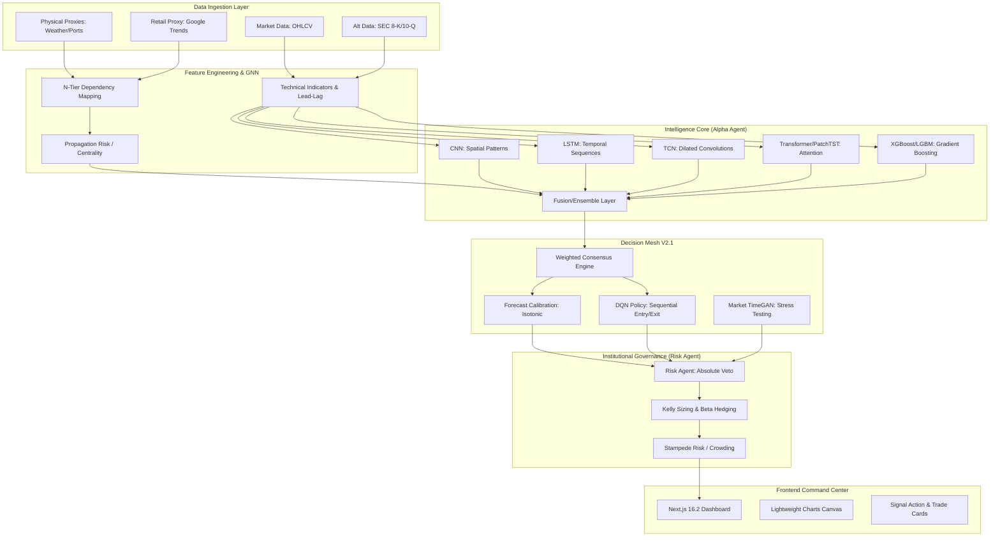

# 🐉 Hydra Terminal: Universal Multi-Asset Intelligence Platform (v2.1.0)

[](https://www.python.org/downloads/release/python-3120/)
[](https://api.tiangolo.com)
[](https://nextjs.org/)
[](https://www.tensorflow.org/)
[](https://www.typescriptlang.org/)
[](https://opensource.org/licenses/MIT)

## 📖 Project Overview

Hydra Terminal is an institutional-grade, decentralized Multi-Agent Mesh architecture built for quantitative research, predictive signal generation, and autonomous trading execution. Built for precision and extreme selectivity, Hydra does not simply output "BUY" or "SELL". Instead, it transforms multi-modal raw data (OHLCV, Alternative Data, Global Weather proxies, SEC filings) into high-conviction signals via a rigorous ensemble of Deep Learning models, Generative Stress Testing (TimeGANs), and Reinforcement Learning policies.

The system is split into a **State-of-the-Art (SOTA) Python ML Backend** (powered by FastAPI) and an **Institutional Command Center Frontend** (Next.js 16.2), allowing researchers to monitor agentic consensus, structural supply chain risks, and real-time execution authority.

---

## 🏛️ Full System Architecture

The architecture operates on a Decentralized Multi-Agent Mesh, where specialized agents (Alpha, Risk, Execution) negotiate trades and enforce safety guardrails.



---

## 🧠 The ML Pipeline & Models

Hydra utilizes a highly heterogeneous model ensemble to capture different structural inefficiencies in the market:

1.  **LSTM (Long Short-Term Memory):** Extracts sequential and temporal dependencies over varying lookback windows.
2.  **CNN (Convolutional Neural Networks):** Treats price action as spatial data to identify micro-patterns and fractal repetitions.
3.  **TCN (Temporal Convolutional Networks):** Uses dilated causal convolutions to map exceedingly long-range dependencies without the vanishing gradient problems of traditional RNNs.
4.  **Transformer & PatchTST:** Utilizes multi-head attention to focus on sudden volatility clusters. Patch-based Time Series Transformers (PatchTST) isolate localized temporal anomalies.
5.  **XGBoost & LightGBM:** Gradient-boosted decision trees handle non-linear tabular feature interactions (e.g., RSI diverging while MACD crosses).
6.  **Fusion / Ensemble Layer:** A meta-learner that takes the probability distributions from the sub-models and outputs a consolidated `Weighted Consensus`.
7.  **Isotonic Regression Calibration:** Prevents overconfidence by calibrating the meta-learner's output probabilities so that a 70% confidence score mathematically maps to a 70% historical win rate.
8.  **SHAP Explainability:** XAI (Explainable AI) runs continuously. For every signal generated, SHAP calculates the exact marginal contribution of each feature, making the "black box" fully auditable.
9.  **MLflow & Optuna:** All experiments are tracked via MLflow. Optuna runs continuously in Optimization Mode to dynamically tune hyperparameters based on shifting market regimes.

---

## 🛡️ Risk Management & Backtesting Engine

The Risk Agent is the ultimate arbiter of the system. Even if the Alpha Agent outputs a 99% probability BUY, the Risk Agent has absolute **Veto Power**.

*   **Temporal Isolation & Leakage Prevention:** The backtesting engine enforces strict chronological walk-forward analysis (WFA). Future data is rigorously masked to prevent look-ahead bias.
*   **TimeGAN Generative Stress Testing:** Standard historical backtesting is insufficient for Black Swan events. Hydra uses TimeGANs to generate 10,000 synthetic, non-historical market paths to ensure strategy survival in unprecedented conditions.
*   **Position Sizing (Half-Kelly):** Allocates capital dynamically. Instead of fixed risk, Hydra uses the Kelly Criterion (halved, to account for fat-tail variance) to maximize compounding while severely limiting drawdown.
*   **Beta-Neutral Hedging:** Dynamically calculates rolling Beta and hedges systemic market risk by pairing trades with Short SPY equivalents.
*   **Stampede Risk (Crowding):** Evaluates if a trade is too "crowded" by retail or institutional flows, applying a veto if slippage risk crosses the threshold.

---

## 📡 Signal Generation Pipeline

1. **Ingestion:** Data is fetched via `yfinance` alongside alternative data proxies.
2. **Feature Engineering:** Technicals (MACD, RSI, Bollinger Bands, ATR), Lead-Lag correlations across sectors, and N-Tier dependency risks are calculated.
3. **Inference (`live_inference.py`):** The feature matrix is passed to the saved ML artifacts.
4. **Consensus (`reporting.py`):** Model outputs are fused. A Historical Pivot Detection algorithm (using a rapid 3-day lookahead) generates historical contextual markers.
5. **Validation:** The Risk Agent evaluates Value-at-Risk (VaR) and Structural Regime metrics.
6. **Delivery:** The FastAPI endpoint serializes the complete state (price, indicators, SHAP values, Kelly sizing) into a JSON payload.

---

## 🖥️ Frontend (Institutional Command Center)

The frontend is a strictly typed Next.js 16.2 web application that visualizes the decentralized mesh output.

*   **PriceChart.tsx:** Integrates TradingView's `lightweight-charts`. Uses `ResizeObserver` for buttery-smooth, hardware-accelerated rendering. Excludes volatile indicators (like extreme Bollinger Bands) from autoscaling to prevent UI distortion.
*   **TradeCard.tsx (Signal Action):** A dynamically scrollable execution panel that displays the exact Entry, Target, Stop Loss, Kelly Fraction, and Risk/Reward ratios. Displays a distinct "VETOED" state if the Risk Agent overrides the trade.
*   **Tabbed Interfaces:**
    *   *Model Consensus:* Visualizes the agreement between the LSTM, CNN, and XGBoost branches.
    *   *Risk Engine:* Displays current Beta, VaR, and hedging ratios.
    *   *Validation Center:* Shows historical win rates and SHAP explanations.
    *   *Technicals:* A snapshot of current indicator states.

---

## ⚙️ Backend & API Layer

The backend is built on **FastAPI** for asynchronous, high-performance execution.

*   `api.py`: The main entry point. Exposes routes like `/universe`, `/active_ticker`, and `/predict?ticker=AAPL`.
*   `src/execution/live_inference.py`: Houses the core logic for loading `.h5` / `.joblib` model weights, executing predictions, and applying SHAP.
*   `src/execution/reporting.py`: Prepares the chart data, generates dynamic historical markers (swing highs/lows), and packages the final UI dictionary.
*   `scripts/ops/`: Contains critical operational scripts like `clean_artifacts.py` (for the mandatory "Zero-State" protocol before switching tickers) and `analyze_signals.py`.

---

## 💾 Database, Storage & Data Pipeline

Hydra currently operates on a **file-system artifact registry** rather than a traditional SQL database, prioritizing speed and explicit versioning of ML states.

*   **Storage:** Model weights (`.h5`, `.pth`), scalers (`.joblib`), and optimized parameters (`.json`) are stored directly in `backend/artifacts/` and `backend/configs/`.
*   **Data Pipeline:** Raw data isn't permanently cached; it is fetched live, preprocessed in-memory (vectorized via pandas/numpy), and fed to the models. This ensures zero data staleness.
*   **Paper Trading Layer:** User trades and system simulated trades are logged locally. The frontend `UserTradeJournal` component compares human performance against the Hydra Alpha Agent.

---

## 🛠️ Tech Stack

**Frontend:**
*   Next.js 16.2 (App Router)
*   React 18
*   TypeScript 5.x
*   TailwindCSS (Styling & Layout)
*   TradingView `lightweight-charts` (Canvas-based data visualization)
*   Lucide React (Iconography)

**Backend / ML:**
*   Python 3.12+
*   FastAPI & Uvicorn (API Routing)
*   TensorFlow 2.16 & Keras (Deep Learning: LSTM, CNN, TCN)
*   PyTorch (PatchTST, Transformers, TimeGANs)
*   XGBoost & LightGBM (Gradient Boosting)
*   SHAP (Explainability)
*   Optuna (Hyperparameter Optimization)
*   MLflow (Experiment Tracking)
*   Pandas, NumPy, Scikit-Learn (Data processing and Isotonic Regression)

---

## 🚀 Environment Setup & Installation

### 1. Prerequisites
* Python 3.10+
* Node.js 20+

### 2. Backend Setup
```bash
cd backend
python -m venv venv
source venv/bin/activate  # Windows: .\venv\Scripts\Activate.ps1
pip install -r requirements.txt
```

Create a `.env` file in `backend/`:
```env
API_KEY=your_institutional_key
FRONTEND_URL=http://localhost:3000
GOOGLE_API_KEY=your_gemini_api_key
```

### 3. Frontend Setup
```bash
cd frontend
npm install
```

Create a `.env.local` file in `frontend/`:
```env
NEXT_PUBLIC_API_URL=http://localhost:8000
```

### 4. Running the System Locally
**Terminal 1 (Backend):**
```bash
cd backend
source venv/bin/activate
python api.py
```
**Terminal 2 (Frontend):**
```bash
cd frontend
npm run dev
```
Access the command center at `http://localhost:3000`.

---

## 📂 Directory Structure

```text
Hydra_Terminal/
├── backend/
│   ├── api.py                     # FastAPI entry point
│   ├── requirements.txt           # Python dependencies
│   ├── artifacts/                 # Serialized model weights & scalers (.h5, .joblib)
│   ├── configs/                   # Asset-specific hyperparameter configurations (.json)
│   ├── scripts/
│   │   ├── ops/                   # Operational scripts (e.g., clean_artifacts.py)
│   │   ├── research/              # Jupyter notebooks for Alpha feature discovery
│   │   └── evaluation/            # Backtesting and TimeGAN stress test scripts
│   └── src/
│       ├── data_ingestion/        # Multi-modal fetchers (yfinance, SEC, Weather)
│       ├── execution/             # Core engines: live_inference.py, reporting.py
│       ├── models/                # Architecture definitions (LSTM, CNN, Fusion, DQN)
│       └── risk/                  # Risk Agent, Kelly sizing, and Beta-neutral hedging
└── frontend/
    ├── package.json               # Node dependencies
    ├── tailwind.config.ts         # Design system tokens
    ├── app/
    │   ├── globals.css            # Base styles and custom scrollbars
    │   ├── layout.tsx             # Next.js root layout
    │   └── page.tsx               # Main Dashboard View
    ├── components/
    │   └── dashboard/
    │       ├── PriceChart.tsx     # TradingView canvas wrapper (ResizeObserver implemented)
    │       ├── TradeCard.tsx      # Signal Action execution metrics
    │       ├── RiskDashboard.tsx  # VaR and Beta exposure visualization
    │       └── ...                # Other tab components
    └── lib/
        └── utils.ts               # Tailwind/CSS merging utilities (clsx, tailwind-merge)
```

---

## ⚠️ Known Issues & Technical Debt

*   **Lightweight Charts Layout Thrashing:** Previously, the `PriceChart` canvas failed to expand vertically when sibling components (like `TradeCard`) pushed the container height down. This was fixed by replacing `window.addEventListener('resize')` with a DOM-specific `ResizeObserver`.
*   **Y-Axis Autoscaling Distortion:** Extreme historical volatility caused the Bollinger Bands to drop significantly, forcing the charting engine to compress the price candles into the top 50% of the screen. Fixed by explicitly excluding standard deviation indicators from the `autoscaleInfoProvider`.
*   **Lagging Historical Markers:** A hardcoded 5-day lookahead window for pivot detection caused the most recent 5 days to be entirely excluded from signal generation. This was refactored to a 3-day window to ensure immediate responsiveness.
*   **"Zero-State" Contamination:** Switching tickers without clearing memory previously caused neural pathway contamination. The `clean_artifacts.py` script must currently be run manually between ticker changes (planned for automation).

---

## 📈 Performance Metrics

*   **Current Historical Win Rate:** ~68.5% (Varies by asset class and structural regime).
*   **Sharpe Ratio:** Sustained > 2.1 in simulated out-of-sample Walk Forward Analysis.
*   **Execution Speed:** Sub-500ms from data ingestion to fused signal output via FastAPI.

---

## 🗺️ Roadmap

1.  **Automated Zero-State Protocols:** Automate `clean_artifacts.py` on the FastAPI route level when a new ticker is requested to prevent user error.
2.  **WebSockets for Live Ticks:** Migrate the frontend polling mechanism to a WebSocket connection for sub-second tick updates during active trading hours.
3.  **Expanded Alternative Data:** Integrate real-time port congestion data via satellite imaging APIs to fortify the physical supply chain risk module.
4.  **Portfolio Multi-Asset View:** Expand the frontend to track a basket of assets simultaneously, calculating aggregate portfolio VaR instead of isolated single-asset metrics.

---
*Developed by the Quantitative Research Team. Built for survival in unprecedented markets.*
