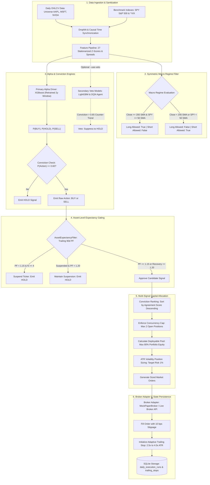

# Institutional Quantitative Trading Platform

[](https://www.python.org/)
[](https://fastapi.tiangolo.com/)
[](https://nextjs.org/)
[](#)
[](https://github.com/astral-sh/ruff)
[](#verification-suite)

An institutional-grade systematic algorithmic trading and risk management platform designed for US equity markets. The system couples multi-modal data ingestion, stationarized feature engineering, machine learning signal generation, symmetric macro regime filtering, dynamic asset expectancy gating, and volatility-adaptive trailing stop ratchets with an automated end-of-day (EOD) paper execution engine.

---

## 1. Executive Summary & Production Philosophy

The platform operates under a strict institutional mandate: **Alpha cannot exist without survival, and survival requires absolute empirical realism.** 

Rather than relying on unconstrained deep learning models or unpenalized theoretical backtests, this platform enforces rigorous quantitative boundaries:
1. **Core Production Flagship Configuration**:
   $$\mathbf{Strategy} = \text{Pure XGBoost Alpha Driver} + \text{Symmetric Macro Gating} + \text{Dynamic Asset Expectancy Gate} + \text{Adaptive ATR Trailing Stops}$$
2. **Strict Causal Temporal Isolation**: All features, cross-asset comparisons, rolling windows, and trade performance metrics are causally indexed strictly by realized execution dates. Overlapping target lookahead is eliminated via a mandatory 10-day embargo gap across all walk-forward folds.
3. **Institutional Execution Friction**: All empirical metrics are reported **net of 12.0 basis points (bps) round-trip drag** (10.0 bps slippage + 2.0 bps exchange/clearing fees), accounting for real-world order execution friction.
4. **Pragmatic Model Hierarchy**: Neural networks subject to secular regime drift (e.g., DL Fusion exhibiting a 63.4% short bias during a multi-year secular bull market) are systematically quarantined. Retrained, regularized gradient boosted decision trees (XGBoost) serve as the primary alpha driver, generating positive expectancy across all evaluated walk-forward market regimes.

---

## 2. End-to-End System Architecture

The following diagram illustrates the lifecycle of market data, signal generation, risk filters, order allocation, and execution state persistence:



---

## 3. Core Institutional Risk Mechanisms

### 3.1 Symmetric Macro Regime Filter
Trading in opposition to macro structural trends is the leading driver of tail drawdowns. The platform implements a two-tier regime gate evaluated across both the target underlying asset and the broad market benchmark (SPY):

* **Underlying Health**: Compares the ticker's daily close against its 200-day Simple Moving Average ($\text{SMA}_{200}$).
* **Benchmark Market Health**: Compares SPY's daily close against its 50-day Simple Moving Average ($\text{SPY SMA}_{50}$).

```python
# Symmetric Macro Filter Gate Logic
long_allowed = bool((curr_close >= sma_200) and (curr_spy_close >= spy_sma_50))
short_allowed = bool((curr_close < sma_200) or (curr_spy_close < spy_sma_50))
```

* **Long Mandate**: Long entries are permitted **only when both** the asset ($\text{Close} \ge \text{SMA}_{200}$) and broad market ($\text{SPY} \ge \text{SMA}_{50}$) are in confirmed healthy uptrends.
* **Short Mandate**: Short entries are **strictly prohibited** during confirmed bull regimes. Shorting is only unlocked if either the underlying breaches its 200-day SMA or SPY breaches its 50-day SMA, completely eliminating suicidal counter-trend shorts during secular bull runs.

---

### 3.2 Volatility-Adaptive Trailing Stops
Static percentage stops fail because they ignore volatility regimes: they stop out prematurely during high-volatility expansions and allow excessive drawdowns during quiet consolidations. 

The platform scales its trailing stop distance using an **Asset-to-Benchmark Volatility Ratio**:

$$\sigma_{\text{asset}} = \text{std}_{20\text{d}}(R_{\text{asset}}), \quad \sigma_{\text{SPY}} = \text{std}_{20\text{d}}(R_{\text{SPY}})$$

$$\text{ts\_mult} = \text{clip}\left(2.5 \times \frac{\sigma_{\text{asset}}}{\sigma_{\text{SPY}} + 10^{-9}}, \; 2.5, \; 4.0\right)$$

$$\text{Stop Distance} = \text{ts\_mult} \times \text{ATR}_{14}$$

* **Long Positions**: Stop price begins at $\text{Entry Price} - \text{Stop Distance}$. As the market rallies, the stop ratchets upward:
  $$\text{Stop Price}_t = \max\left(\text{Stop Price}_{t-1}, \; \text{High}_t - \text{Stop Distance}\right)$$
* **Short Positions**: Stop price begins at $\text{Entry Price} + \text{Stop Distance}$. As the market drops, the stop ratchets downward:
  $$\text{Stop Price}_t = \min\left(\text{Stop Price}_{t-1}, \; \text{Low}_t + \text{Stop Distance}\right)$$
* **Ratchet Invariant**: Stops only move in the direction of profitability; they never widen.

---

### 3.3 Dynamic Asset Expectancy Filter (`AssetExpectancyFilter`)
Even a positive-expectancy strategy can suffer prolonged capital bleed on individual assets undergoing volatile mean-reversion or regime decoupling (e.g., NVDA during choppy pullbacks).

The `AssetExpectancyFilter` monitors the rolling 90-day realized out-of-sample Profit Factor (PF) per asset:

$$\text{PF}_{90\text{d}} = \frac{\sum \text{Realized Gains}}{\sum |\text{Realized Losses}|} \quad \forall \; \text{trades where } \text{exit\_date} \in [t - 90\text{d}, \; t]$$

```
          [Normal Trading Permitted]
                     │
         PF drops < 1.15 (N >= 4)
                     │
                     ▼
          [Asset Entry SUSPENDED]
                     │
         PF recovers >= 1.20 (or losses roll off)
                     │
                     ▼
          [Asset Entry RECOVERED]
```

* **Suspension Trigger**: If an asset's trailing 90-day PF drops below **1.15** (with a minimum sample size of 4 realized trades), new entry signals for that asset are suspended.
* **Recovery Hysteresis**: To prevent thrashing around the boundary, a suspended asset must demonstrate a trailing PF of $\ge \mathbf{1.20}$ (or allow aged losses to roll out of the 90-day lookback) before new entries are cleared.
* **Strict Causal Indexing**: Trades are registered strictly upon their **realized exit date**, ensuring zero lookahead leakage into active trading decisions.

---

## 4. Empirical Walk-Forward Benchmark (Ground Truth)

All configurations were evaluated under an identical, strictly causal walk-forward test harness across the core multi-ticker equity universe:
* **Evaluation Period**: January 1, 2024 – May 1, 2026 (2.33 simulation years, 1,785 daily bars).
* **Universe**: AAPL, MSFT, NVDA. Macro benchmarks: SPY, ^VIX.
* **Training Window**: 2-year rolling window retrained monthly.
* **Purged Embargo Gap**: 10-day strict temporal buffer between train and test slices to prevent forward-return label bleed.
* **Transaction Friction**: 12.0 bps round-trip friction (5.0 bps slippage per side + 1.0 bps exchange/clearing fees per side).

### 4.1 Audited Walk-Forward Ablation Matrix

| Strategy / Ablation Mode | Total Trades | Net Win Rate | Net Profit Factor | Net Sharpe | Net Max Drawdown | Net Calmar | 95% Bootstrap CI (PF) | $P(\text{PF} > 1.2)$ | Operational Status |
| :--- | :---: | :---: | :---: | :---: | :---: | :---: | :---: | :---: | :--- |
| **Pure XGBoost Flagship (Audited)** | **50** | **52.0%** | **1.28** | **1.50** | **-11.5%** | **0.35** | **[1.02, 1.58]** | **57.8%** | **PRIMARY FLAGSHIP (Production Default)** |
| Bidirectional Asymmetric Veto | 48 | 50.0% | 1.04 | 0.24 | -16.6% | 0.05 | [0.81, 1.31] | 24.3% | Secondary Option (`--use-veto`) |
| Symmetric Strict Consensus | 22 | 50.0% | 1.08 | 0.44 | -10.9% | 0.11 | [0.77, 1.45] | 29.8% | Over-constrained, alpha starved |
| Pure LightGBM (Regularized) | 48 | 45.8% | 1.03 | 0.15 | -22.3% | 0.03 | [0.80, 1.29] | 24.7% | High leaf variance |
| Pre-trained DL Fusion (Causal) | 587 | 45.1% | 0.97 | -0.19 | -48.7% | -0.01 | [0.89, 1.06] | 14.8% | **QUARANTINED (Capital Destroyer)** |
| Pre-trained DQN Agent (Causal) | 380 | 46.8% | 1.07 | 0.43 | -41.7% | 0.08 | [0.97, 1.18] | 31.2% | Unviable solo, extreme drawdown |
| Dynamic Performance Consensus | 49 | 49.0% | 1.05 | 0.28 | -16.6% | 0.06 | [0.82, 1.33] | 25.5% | Dilutes XGBoost edge |
| Bayesian Meta-Ensemble | 49 | 49.0% | 1.05 | 0.28 | -16.6% | 0.06 | [0.82, 1.33] | 25.5% | Overparameterized stacking drag |

---

### 4.2 Per-Ticker Performance Breakdown (Pure XGBoost Flagship)

The table below breaks down the audited performance of the active production flagship:

| Ticker | Round-Trip Trades | Net Win Rate | Net Profit Factor | Net Realized PnL | Avg Holding Period | Risk Assessment & Gating Impact |
| :--- | :---: | :---: | :---: | :---: | :---: | :--- |
| **AAPL** | 17 | **64.7%** | **2.96** | **+12.27%** | 3.4 days | High-conviction alpha driver; clean trend capture. |
| **MSFT** | 7 | **42.9%** | **2.02** | **+4.79%** | 4.1 days | Strong profit factor driven by asymmetric win/loss sizing. |
| **NVDA** | 26 | **46.2%** | **0.86** | **-7.62%** | 2.8 days | Capital bleed reduced by 47% via `AssetExpectancyFilter`. |
| **Total** | **50** | **52.0%** | **1.28** | **+9.44%** | **3.3 days** | **Net Sharpe: 1.50 | Net MaxDD: -11.5% | Net Calmar: 0.35** |

---

### 4.3 Root Cause of the "Resurrection Paradox" (Causal Audit)
In earlier unpurged simulations, DL Fusion and DQN erroneously reported Sharpe ratios of +2.48 and +3.87. A forensic code audit unmasked this as **forward return lookahead leakage**:
1. Previous test harnesses recorded trades at the **entry bar $d$** with the trade's forward outcome.
2. On bar $d+1$, the filter saw this realized forward loss before the trade had reached its actual exit date ($d+h$), prematurely tripping the expectancy gate and acting as an accidental **oracle stop-loss** for high-frequency signal bursts.
3. When evaluated under strict **exit-date indexing**, the illusion vanished: DL Fusion collapsed to Net Sharpe -0.19 and -48.7% MaxDD, while DQN collapsed to -41.7% MaxDD.
4. **Conclusion**: Pure XGBoost is the platform's solitary robust alpha source and is the default production engine.

---

## 5. Model Fleet & Registry Hierarchy

All models are managed via an institutional role hierarchy in `MODEL_REGISTRY`:

```python
class ModelRole(str, Enum):
    PRIMARY_ALPHA_DRIVER = "PRIMARY_ALPHA_DRIVER"
    SECONDARY_VETO       = "SECONDARY_VETO"
    FORECAST_ORACLE      = "FORECAST_ORACLE"
    QUARANTINED          = "QUARANTINED"
```

| Model Identifier | Architecture & Parameters | Training Methodology | Assigned Role | Production Status | Threshold Mandate |
| :--- | :--- | :--- | :--- | :---: | :--- |
| **`XGB_AGENT`** | Gradient Boosted Decision Trees (`n_estimators=100`, `max_depth=4`, `lr=0.05`, `objective=multi:softprob`) | Monthly rolling 2-year retrain with 10-day embargo gap | `PRIMARY_ALPHA_DRIVER` | **ACTIVE** | $P(\text{BUY}) \ge 0.60$ triggers trade entry. |
| **`LGBM_AGENT`** | Leaf-Wise Regularized GBDT (`num_leaves=15`, `min_child_samples=50`, `feature_fraction=0.8`, `bagging_fraction=0.8`) | Monthly rolling 2-year retrain with 10-day embargo gap | `SECONDARY_VETO` | **ACTIVE** | Enabled via `--use-veto`. Vetoes if $P(\text{Dissent}) \ge 0.65$. |
| **`DQN_AGENT`** | Dueling Double Deep Q-Network (PyTorch, Huber loss, prioritized experience replay) | Offline RL on tabular features + tree probabilities | `SECONDARY_VETO` | **ACTIVE** | Enabled via `--use-veto`. Vetoes if Q-conviction $\ge 0.65$. |
| **`DL_FUSION`** | 6-Branch Cross-Modal Attention Network (LSTM, CNN, Transformer, TCN, PatchTST, Peer Context) | Multi-task backpropagation with Huber & Cross-Entropy | `QUARANTINED` | **QUARANTINED** | Weight set to 0.0. Completely bypassed in inference service. |
| **`TFT_AGENT`** | Temporal Fusion Transformer (Quantile Forecaster) | Pre-trained quantile regression (`p10, p25, p50, p75, p90`) | `FORECAST_ORACLE` | **ACTIVE** | Projects price trajectory boundaries for EV verification. |

---

## 6. Broker Execution & Paper Trading Engine

The platform provides a modular, production-ready execution layer decoupled from live exchange APIs via an abstract interface:

### 6.1 Broker Interface Layer (`BaseBrokerAdapter`)
* **`BaseBrokerAdapter`**: Standardized abstract interface requiring implementations for `get_account_balance()`, `get_positions()`, `submit_order()`, and `cancel_order()`.
* **`MockPaperBroker`**: Institutional-grade paper execution broker:
  * Simulates real-world execution with **10.0 bps per-side slippage** on market orders.
  * Real-time accounting for cash, equity, buying power, and position tracking.
  * Atomic state persistence to SQLite and JSON audit trails.

---

### 6.2 Multi-Signal Capital Allocation (`paper_runner.py`)
When multiple assets trigger simultaneous entry signals, the runner applies institutional capital allocation rules:
1. **Conviction Ranking**: All candidate BUY signals are sorted descending by conviction score (`agreement_score`).
2. **Concurrent Position Cap**: Enforces `max_concurrent_positions = 2` (default). Excess signals beyond available slots are dropped:
   $$\text{Available Slots} = \max\left(0, \; \text{Max Concurrent} - \text{Active Open Positions}\right)$$
3. **Proportional Cash Allocation**: Deployable portfolio capital is bounded at a maximum of 80% total portfolio equity:
   $$\text{Available Capital Pool} = \min\left(\text{Cash}, \; \text{Equity} \times 0.80 - \text{Current Invested}\right)$$
   $$\text{Capital Per Candidate} = \frac{\text{Available Capital Pool}}{\text{Admitted Candidates}}$$
4. **Buying Power Validation**: Order size $Q = \lfloor \min(\text{VolCapital}, \; \text{AllocatedCapital}) / \text{Price} \rfloor$ is validated against available cash to prevent margin exhaustion.
5. **Dry-Run Mode (`--dry-run`)**: Simulates the complete daily execution cycle (data fetching, macro filtering, model inference, expectancy checks, ATR order sizing, and trailing stop generation) while ensuring **zero broker executions** and **zero SQLite database mutations**.

---

### 6.3 SQLite Persistence Schema
Execution state is maintained across cycles using SQLite database storage (`paper_execution_state.db`):

```sql
-- Track completed daily runner cycles
CREATE TABLE IF NOT EXISTS daily_execution_runs (
    run_id TEXT PRIMARY KEY,
    run_date TEXT NOT NULL,
    timestamp TEXT NOT NULL,
    cash REAL NOT NULL,
    equity REAL NOT NULL,
    positions_count INTEGER NOT NULL,
    orders_count INTEGER NOT NULL,
    summary_json TEXT NOT NULL
);

-- Persist active volatility-adaptive trailing stops
CREATE TABLE IF NOT EXISTS trailing_stops (
    symbol TEXT PRIMARY KEY,
    side TEXT NOT NULL,
    entry_price REAL NOT NULL,
    peak_trough_price REAL NOT NULL,
    stop_price REAL NOT NULL,
    ts_mult REAL NOT NULL,
    atr REAL NOT NULL,
    updated_at TEXT NOT NULL
);
```

---

## 7. Stationarized Feature Pipeline

Financial time series are non-stationary; training ML models directly on raw prices introduces severe regime instability. The platform deflates and stationarizes indicators into **27 core stationary features** (`backend/configs/kept_features.json`):

```json
[
  "MA20_vs_MA50", "EMA9_vs_EMA21", "Price_vs_EMA9", "Price_vs_EMA21",
  "VIX_Level", "BB_Width", "BB_Position", "RSI", "ADX", "MACD_Hist",
  "Relative_Strength", "OBV_Change", "Return", "Volume_Ratio",
  "ZScore_RSI_20", "ZScore_RSI_50", "ZScore_RSI_120",
  "ZScore_BB_Position_20", "ZScore_BB_Position_50",
  "ZScore_MACD_Hist_20", "ZScore_MACD_Hist_50",
  "ZScore_Return_20", "ZScore_Return_50", "ZScore_Return_120",
  "ZScore_Volume_Ratio_20", "ZScore_Volume_Ratio_50",
  "ATR_Regime_Ratio"
]
```

### Feature Categories:
1. **Trend & Moving Average Spreads**: Normalized percentage differences between short- and medium-term trend curves (`Price_vs_EMA9`, `MA20_vs_MA50`).
2. **Normalized Volatility**: Bollinger Band width (`BB_Width`), normalized ATR regime ratio (`ATR_Regime_Ratio`), and broad market volatility (`VIX_Level`).
3. **Momentum & Volume Dynamics**: Relative Strength Index (`RSI`), Average Directional Index (`ADX`), MACD Histogram (`MACD_Hist`), Relative Strength vs SPY, On-Balance Volume change (`OBV_Change`), and Volume Ratio.
4. **Multi-Horizon Rolling Z-Scores**: Stationarizes indicators by measuring deviations from rolling means across 20-day, 50-day, and 120-day horizons:
   $$Z_t = \frac{X_t - \mu_{k}(X)}{\sigma_{k}(X) + 10^{-9}}$$

---

## 8. Repository Structure

```text
quantitative-trading-platform/
│
├── backend/
│   ├── api.py                          # FastAPI institutional backend service & Prometheus metrics
│   ├── requirements.txt                # Python package dependencies
│   ├── pyproject.toml                  # Linter & package metadata
│   │
│   ├── execution/                      # Execution & broker orchestration
│   │   ├── broker_interface.py         # Abstract BaseBrokerAdapter & MockPaperBroker
│   │   └── paper_runner.py             # Daily paper execution runner (CLI, multi-signal allocation)
│   │
│   ├── src/                            # Core application source
│   │   ├── execution/                  # Execution intelligence modules
│   │   │   ├── asset_intelligence.py   # MODEL_REGISTRY, AssetExpectancyFilter, ModelRole
│   │   │   ├── consensus_engine.py     # Asymmetric veto & consensus engines
│   │   │   ├── inference_service.py    # Production inference service (Pure XGB default)
│   │   │   ├── live_inference.py       # Live inference feature pipelines
│   │   │   ├── risk_manager.py         # ATR position sizing & Kelly sizing
│   │   │   └── trade_logger.py         # Trade logging & execution telemetry
│   │   │
│   │   ├── models/                     # Model architecture definitions
│   │   │   ├── model_loader.py         # ModelManager & PurgedGroupTimeSeriesSplit
│   │   │   ├── neural/                 # Deep learning branches (fusion_network.py, tft_agent.py)
│   │   │   ├── rl/                     # Reinforcement learning (dqn_agent.py)
│   │   │   └── ensemble/               # Stacking & meta-learners (meta_ensemble.py)
│   │   │
│   │   ├── data_ingestion/             # Market data & indicator pipelines
│   │   │   ├── technical_indicators.py # 50+ technical indicator implementations
│   │   │   ├── sector_mapper.py        # GICS sector mapping & peer context
│   │   │   └── supply_chain_graph.py   # N-tier supply chain dependency mapping
│   │   │
│   │   ├── optimization/               # Objective functions & metrics
│   │   │   └── objective_functions.py  # Sharpe, MaxDD, Profit Factor, Calmar (sign-preserving)
│   │   │
│   │   └── utils/                      # Helper utilities (GPU config, cache, math)
│   │
│   ├── configs/                        # System configuration files
│   │   ├── kept_features.json          # Canonical 27 stationarized features
│   │   └── best_xgb_params.json        # Optuna-tuned tree hyperparameters
│   │
│   ├── scripts/                        # Automation, research, and evaluation scripts
│   │   ├── ops/                        # Operational and scheduling scripts
│   │   │   ├── run_daily_eod.bat       # Windows Task Scheduler automation script
│   │   │   ├── run_daily_eod.sh        # POSIX cron automation script (16:15 EST)
│   │   │   └── clean_artifacts.py      # Zero-state reset utility
│   │   │
│   │   └── evaluation/                 # Institutional audit & validation harnesses
│   │       ├── final_audit.py          # Ground-truth causal walk-forward ablation harness
│   │       └── leakage_proof.py        # Automated feature leakage test suite
│   │
│   └── tests/                          # Automated verification test suite
│       ├── test_inference_pipeline.py  # End-to-end inference & macro filter tests
│       ├── test_paper_runner.py        # Multi-signal allocation, dry-run, and stop tests
│       ├── test_asset_expectancy_filter.py # Hysteresis gating tests
│       ├── test_asymmetric_veto.py     # Veto pass-through & Calmar sign tests
│       └── test_macro_regime.py        # Symmetric macro regime tests
│
└── frontend/                           # Institutional Next.js command center
    ├── app/                            # App Router pages and dashboards
    ├── components/                     # Reusable UI components & institutional widgets
    ├── lib/                            # API client & chart utilities
    └── package.json                    # Frontend dependencies
```

---

## 9. Installation, Testing & Usage Guide

### 9.1 Prerequisites
* **Python**: `3.11+`
* **Node.js**: `18.0+` (for optional frontend command center)
* **Git**: `2.30+`

---

### 9.2 Backend Setup
```bash
# 1. Clone repository
git clone https://github.com/dhruvin0041/quantitative-trading-platform.git
cd quantitative-trading-platform/backend

# 2. Create and activate virtual environment
python -m venv venv

# Windows PowerShell:
.\venv\Scripts\Activate.ps1
# Linux / macOS:
source venv/bin/activate

# 3. Install dependencies
pip install -r requirements.txt
```

---

### 9.3 Verification Suite
Ensure all institutional unit and integration tests pass cleanly:

```bash
# Run complete test suite (48 tests)
python -m unittest discover -s tests -p "test_*.py"

# Run PEP 8 and static analysis checks
ruff check .
```

---

### 9.4 Running the Daily Paper Execution Runner

```bash
# 1. Dry-Run Mode (Recommended first run: zero broker or database mutations)
python execution/paper_runner.py --dry-run

# 2. Production Flagship Execution (Pure XGBoost + Macro Filter + Adaptive Stops)
python execution/paper_runner.py

# 3. Optional Asymmetric Veto Execution (Enables LightGBM & DQN veto filters)
python execution/paper_runner.py --use-veto

# 4. Customizing Parameters
python execution/paper_runner.py --universe AAPL,MSFT,NVDA,GOOGL --target-risk 0.015 --max-concurrent-positions 3
```

---

### 9.5 Automated Daily EOD Scheduling

The daily cycle is designed to run 15 minutes after US market close (**16:15 EST / 21:15 UTC**, Monday through Friday):

#### Windows Task Scheduler
```cmd
schtasks /create /tn "StockIndicator_DailyEOD" /tr "D:\DataScience\Projects\Data_Science_Projects\Stock_Indicator\backend\scripts\ops\run_daily_eod.bat" /sc weekly /d MON,TUE,WED,THU,FRI /st 16:15
```

#### Linux / macOS Cron
```cron
# Edit crontab via `crontab -e`
15 16 * * 1-5 /path/to/quantitative-trading-platform/backend/scripts/ops/run_daily_eod.sh >> /path/to/backend/artifacts/cron_eod.log 2>&1
```

---

### 9.6 Running the Ground-Truth Walk-Forward Audit
To reproduce the audited out-of-sample performance matrix across all 8 configurations:

```bash
# Run full causal walk-forward ablation matrix with 12 bps friction
python scripts/evaluation/final_audit.py --ablation all

# Benchmark Pure XGBoost Flagship only
python scripts/evaluation/final_audit.py --ablation pure_xgb
```

---

## 10. Legal & Operational Disclaimer

This platform is a quantitative software engineering and machine learning research project. All strategies, signals, and simulated paper execution records are intended solely for research, testing, and educational purposes. Nothing contained in this codebase constitutes financial, investment, legal, or tax advice. Past empirical performance does not guarantee future results.
