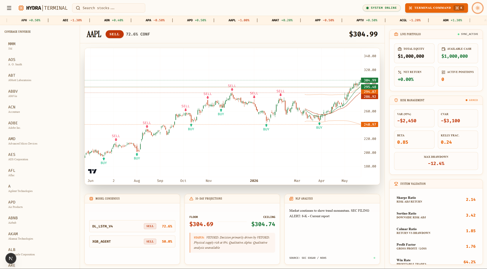
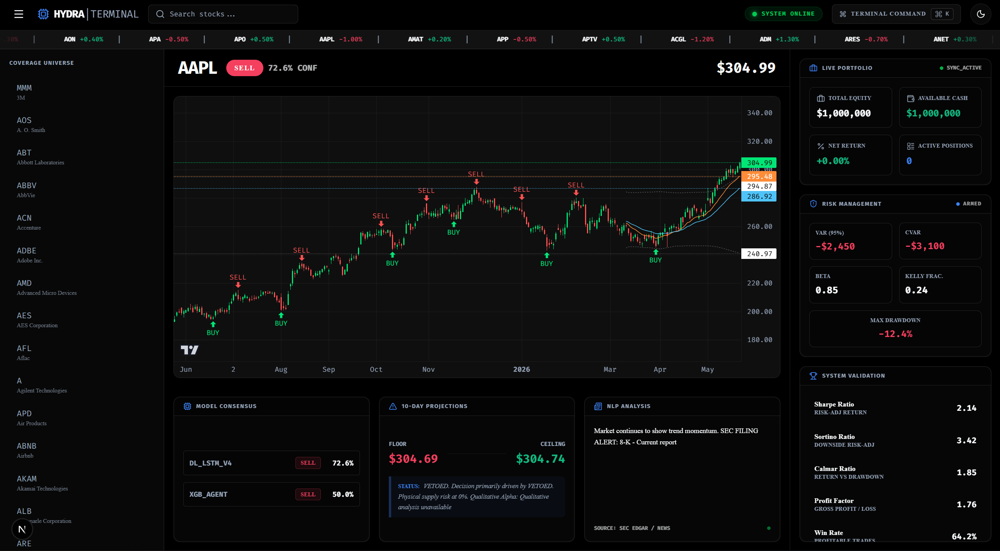

<div align="center">

# HYDRA TERMINAL

> Institutional-Grade AI Signal Intelligence Platform

<p align="center">
  
  
  
  
  
  
  
  
  
  
</p>

<table align="center">
  <tr>
    <td align="center">
      
      <br />
      <em>Light Mode</em>
    </td>
    <td align="center">
      
      <br />
      <em>Dark Mode</em>
    </td>
  </tr>
</table>

</div>

---

## 📑 Executive Summary

Hydra Terminal is a full-stack, institutional-grade stock signal system that utilizes advanced machine learning models to generate real-time BUY/SELL signals on S&P 500 stocks. Designed for quantitative researchers and systematic traders, it provides a comprehensive dashboard integrating live market data, multi-agent AI analysis, and mathematically rigorous risk management.

**Core Philosophy:** Remove human bias by relying entirely on quantitative model consensus, dynamic volatility targeting, and strict elimination of look-ahead and survivorship biases.

---

## 🔬 Strategy Overview

Hydra Terminal employs a multi-modal, hybrid machine learning approach to signal generation:

1.  **Technical & Volatility Features:** Calculates advanced indicators including Wilder's ADX, ATR, Bollinger Band positioning, MACD histograms, and volume anomalies.
2.  **Market Regime Detection:** Dynamically adjusts required confidence thresholds based on broader market trends (SPY) and volatility (VIX).
3.  **Fundamental Alpha:** Utilizes Google Gemini API to analyze news sentiment and fundamental catalysts.
4.  **Multi-Agent Consensus:** Employs an ensemble of independent models (Deep Learning Fusion Network, XGBoost, LightGBM, and DQN) that must reach a majority consensus before issuing a signal.

---

## 🎯 Signal Methodology

Signals are generated through a strict, multi-layered consensus protocol:

- **BUY Signal:** At least two primary models predict upward movement with probability exceeding the dynamically adjusted conviction threshold.
- **SELL Signal:** At least two primary models predict downward movement with probability exceeding the threshold.
- **VETOED / HOLD:** The models conflict, lack strong conviction, or are suppressed by safety filters (e.g., low volume anomaly, impending earnings).
- **Zero Look-Ahead Bias:** Targets are generated using Dynamic Triple Barrier Labeling, rigorously checking intrabar High/Low breaches to prevent future leakage.

---

## 🏗️ Architecture

Hydra Terminal is built on a decoupled, high-performance architecture.

### Backend (Python / FastAPI)
- **Multi-Agent Orchestrator:** `api.py` coordinates inference across LSTM, XGBoost, and LightGBM models.
- **Data Ingestion:** `market_data.py` and `technical_indicators.py` process real-time OHLCV data, applying mathematically precise transformations (e.g., Wilder's EMA for RSI).
- **Risk Management:** `risk_manager.py` enforces Kelly Criterion sizing, computes Jensen's Alpha, and monitors stampede/crowding risks.
- **Backtesting Engine:** `backtester.py` provides a framework for Walk-Forward Optimization and synthetic scenario testing.

### Frontend (Next.js / React / TailwindCSS)
- **Command Center:** Institutional dashboard featuring seamless TradingView chart integration.
- **Real-Time Telemetry:** Displays model consensus, confidence scores, and dynamic 10-day floor/ceiling projections.
- **Risk Dashboards:** Tracks live portfolio metrics including VaR (95%), CVaR, Beta, and Max Drawdown.

---

## 🚀 Installation & Setup

### Prerequisites
- Node.js 18+
- Python 3.11+
- Google AI Studio API key

### 1. Clone the repository
```bash
git clone https://github.com/yourusername/hydra-terminal.git
cd hydra-terminal
```

### 2. Backend Setup
```bash
cd backend
python -m venv venv
source venv/bin/activate  # On Windows: venv\Scripts\activate
pip install -r requirements.txt
```

Create a `.env` file in the `backend/` directory:
```env
GOOGLE_API_KEY=your_gemini_api_key_here
PORT=8000
ENVIRONMENT=development
```

### 3. Frontend Setup
```bash
cd ../frontend
npm install
```

---

## 💻 Usage

**1. Start the Backend Server**
```bash
cd backend
uvicorn api:app --host 0.0.0.0 --port 8000 --reload
```

**2. Start the Frontend Server**
Open a new terminal window:
```bash
cd frontend
npm run dev
```

**3. Access the Dashboard**
Navigate to: [http://localhost:3000](http://localhost:3000)

---

## ⚙️ Configuration

The system's behavior is driven by `configs/model_params.yaml`. Key parameters include:
- `time_steps`: Lookback window for LSTM sequence generation.
- `tp_atr_multiplier` & `sl_atr_multiplier`: Dynamic triple barrier profit and loss targets.
- `max_seq_length`: Tokenizer limits for NLP sentiment analysis.

---

## 📊 Backtesting Methodology

Hydra Terminal includes a robust `backtester.py` designed to emulate institutional standards:
- **Walk-Forward Optimization (WFO):** Prevents overfitting by sequentially shifting the training and out-of-sample testing windows.
- **Realistic Assumptions:** Incorporates configurable slippage and commission models.
- **Circuit Breakers:** Implements system-level maximum drawdown limits that halt trading during extreme market stress.

---

## ⚠️ Risk Disclosures & Limitations

- **Not Financial Advice:** This software is for educational and research purposes only. It does not constitute financial advice.
- **API Limits:** The Gemini qualitative analysis relies on Google AI Studio's free tier. Rate limits may apply.
- **Execution:** The current version supports paper trading and analysis. Live brokerage execution (e.g., Alpaca, Interactive Brokers) requires manual integration.

---

## 🗺️ Roadmap

- [ ] Live execution integration with Alpaca API
- [ ] Multi-timeframe analysis (1H, 4H, Daily)
- [ ] Expanded asset class coverage (Crypto, Forex)
- [ ] Integration of Macroeconomic indicators (FRED API)
- [ ] Enhanced distributed training pipeline using Ray

---

## 🤝 Contributing

We welcome contributions! 
1. Branch from `main` using `feat/` or `fix/` prefixes.
2. Ensure all tests pass (`python -m unittest discover tests`).
3. Follow [Conventional Commits](https://www.conventionalcommits.org/).

---

## 📄 License

This project is licensed under the [MIT License](LICENSE).

<div align="center">
  <i>Removing emotion, executing with precision.</i>
</div>