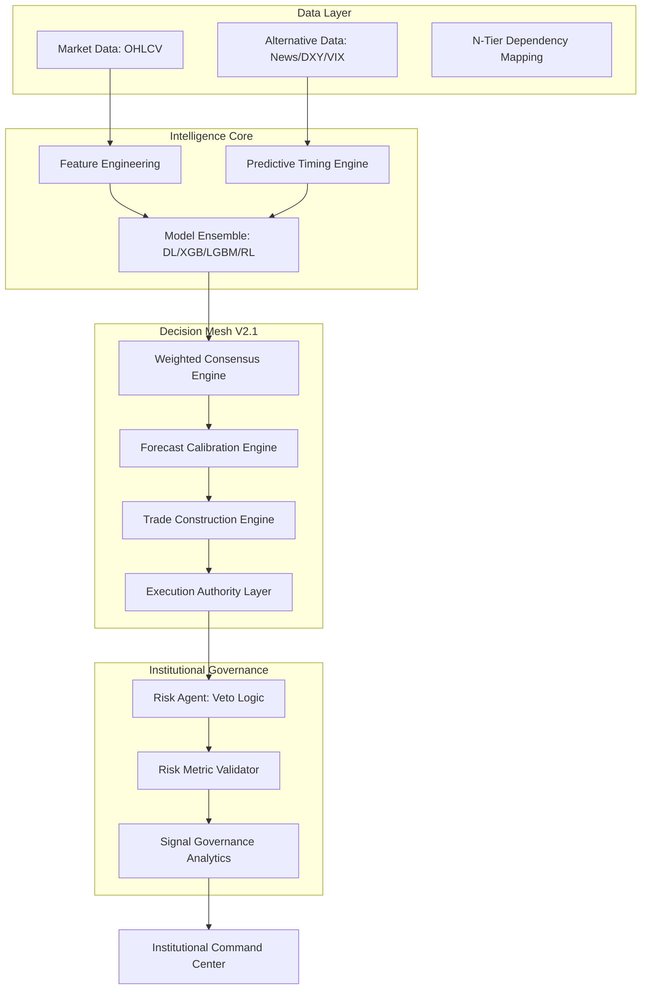

# 🐉 Hydra Terminal: Universal Multi-Asset Intelligence Platform (v2.1.0)

[](https://www.python.org/downloads/release/python-3120/)
[](https://api.tiangolo.com)
[](https://nextjs.org/)
[](https://www.tensorflow.org/)
[](https://www.typescriptlang.org/)
[](https://opensource.org/licenses/MIT)

Hydra Terminal is an institutional-grade quantitative research workstation and universal signal intelligence platform. Built for precision and selectivity, Hydra transforms raw market data into high-conviction trading signals across multiple asset classes using a multi-agent ensemble architecture and rigorous statistical validation.

## 🚀 Key Capabilities (V2.1.0 Upgrade)

### Predictive Signal Intelligence
*   **Predictive Timing Engine:** Replaces lagging indicators with momentum curvature (2nd derivative of price) and volatility expansion metrics to detect trend transitions *before* they occur.
*   **Weighted Consensus Engine:** Replaced binary unanimity with weighted directional pressure mapping, enabling granular directional consensus intensity.
*   **Explainable Confidence Matrix:** Decomposes confidence scores into auditable sub-scores: Trend, Regime, Volatility, Consensus, EV, and Timing.

### Calibrated Forecasting & Construction
*   **Forecast Calibration Engine:** Dynamically bounds point forecasts using asset-specific volatility envelopes (P10/P50/P90) and rejects unrealistic projections.
*   **Trade Construction Engine:** Generates precise Entry, Stop, and Target levels based on ATR multiples aligned with regime mechanics and risk-reward constraints.
*   **Forecast Interpretation Engine:** Automatically maps distribution skew and spread to semantic biases (e.g., "Bullish Expansion", "Volatility Spike Risk").

### Institutional Risk & Authority
*   **Execution Authority Layer:** A centralized decision engine that acts as the final arbiter for capital deployment, mapping telemetry to EXECUTE, REDUCE SIZE, or OBSERVE states.
*   **Risk Metric Validator:** Prevents "Impossible Metrics" (e.g., positive Sharpe with negative returns) and enforces strict 90-day return gates for statistical significance.
*   **Signal Governance Analytics:** Monitors veto frequency and ensemble entropy to prevent over-defensive paralysis and ensure healthy signal throughput.

### Institutional Frontend & UI Architecture
*   **High-Performance Canvas Charting:** Integrates TradingView's `lightweight-charts` for buttery-smooth, hardware-accelerated rendering of multi-year price histories, volume histograms, and dynamic Bollinger Band/Moving Average overlays.
*   **Dynamic Layout & Responsive Scaling:** Utilizes `ResizeObserver` patterns and advanced Flexbox mechanics to ensure chart dimensions and aspect ratios adapt perfectly to changing data loads, completely eliminating layout thrashing or CSS voids.
*   **Contextual Trade Modules:** Features adaptive, scrollable Signal Action cards that present entry targets, stop losses, Kelly sizing fractions, and risk/reward ratios side-by-side with live price action.
*   **Historical Pivot Detection:** Employs a rapid 3-day look-ahead window for immediate detection of swing highs and lows, allowing the frontend to plot precise Buy/Sell historical markers without lagging the most recent market sessions.

## 📊 Supported Asset Classes

Hydra Terminal provides **Asset-Specific Intelligence**, applying unique alpha drivers and risk multipliers depending on the asset profile:

| Class | Highlights | Verified Assets |
| :--- | :--- | :--- |
| **Equities** | Earnings Windows, Sector Rotation, Market Breadth | AAPL, TSLA, NVDA, RELIANCE.NS |
| **Commodities** | DXY Correlation, Real Yield Pressure, Macro Fear | Gold (GC=F), Silver, Crude Oil |
| **Crypto** | Funding Rates, Volatility Compression, Dominance | BTC, ETH, SOL, BNB |
| **Forex** | Interest Rate Differentials, Mean Reversion Scales | EURUSD, USDJPY, USDINR |
| **Indices** | Global Sentiment, Breadth-Aware Volatility | S&P 500, NASDAQ, NIFTY |

## 🏗 Architecture



## 🛠 Installation

### Prerequisites
*   **Python 3.10+**
*   **Node.js 20+**
*   **Git**

### 1. Backend Setup
```bash
cd backend
python -m venv venv
source venv/bin/activate  # Windows: .\venv\Scripts\activate
pip install -r requirements.txt
```

### 2. Environment Configuration
Create a `.env` file in the `backend/` directory:
```bash
API_KEY=your_institutional_key
FRONTEND_URL=http://localhost:3000
GOOGLE_API_KEY=your_gemini_api_key
```

### 3. Frontend Setup
```bash
cd frontend
npm install
```

## 🚦 Running Hydra

### Start Backend
```bash
cd backend
$env:PYTHONPATH='.'  # PowerShell
python api.py
```

### Start Frontend
```bash
cd frontend
npm run dev
```

### Institutional Commands
*   **Institutional Audit:** `python backend/scripts/ops/generate_report.py --audit`
*   **Governance Review:** `python backend/scripts/ops/analyze_signals.py`
*   **Forensic Reset:** `python backend/scripts/ops/clean_artifacts.py [--full]`

## 📁 Repository Structure
*   `backend/src/execution/`: Core V2.1 Engines (Consensus, Forecast, Trade, Authority, Timing).
*   `backend/src/models/`: Multi-agent ensemble (Neural, Boosting, RL).
*   `backend/src/data_ingestion/`: Multi-modal data fetching and GNN mappings.
*   `frontend/app/`: Next.js 16.2 Institutional Command Center.
*   `docs/`: Detailed technical specifications and forensic reports.

---
**Hydra Terminal** — built for precision, grounded in data, executed by authority.
