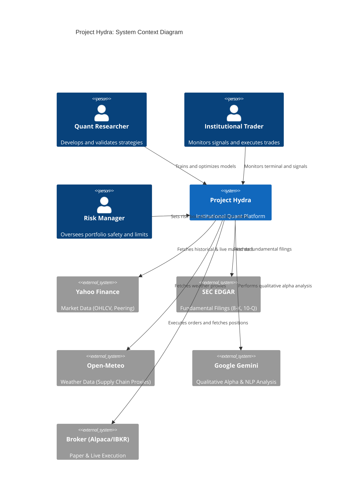
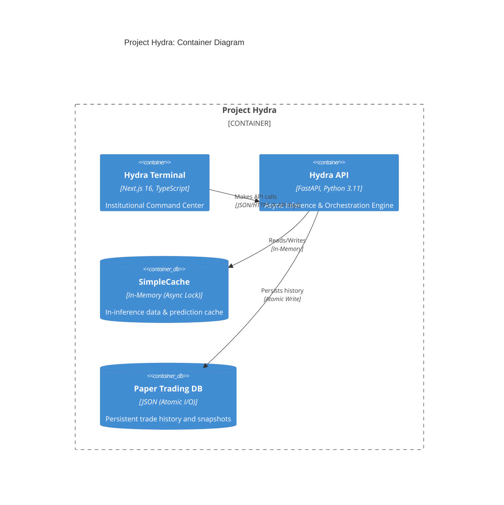

# Project Hydra: Institutional Quant Trading & Research Platform

[](https://www.python.org/)
[](https://fastapi.tiangolo.com/)
[](https://nextjs.org/)
[](https://www.typescriptlang.org/)
[](https://www.docker.com/)
[](https://opensource.org/licenses/MIT)
[](https://github.com/dhruvin0041/stock-indicator-buy-sell/actions)

Project Hydra is a state-of-the-art (SOTA) 2026 multi-modal, multi-agent hedge fund execution and research platform. It is designed for professional quantitative researchers, institutional traders, and risk managers to generate high-conviction BUY, SELL, and HOLD signals for equities using advanced machine learning, alternative data, and decentralized agentic orchestration.

## 🚀 Key Features

- **Multi-Modal Data Ingestion**: Synthesizes technical (OHLCV), macro (VIX regimes), alternative (Supply chain maps, port weather), and sentiment (SEC EDGAR, News via FinBERT) data layers.
- **5-Model Hybrid Ensemble**: Fuses LSTM (Temporal), CNN (Pattern), Transformer (Long-range), XGBoost (Tabular), and DQN (Policy) models for high-fidelity signal generation.
- **Multi-Agent Orchestration**: A decentralized agentic mesh where **Alpha**, **Risk**, and **Execution** agents negotiate trades and enforce safety guardrails.
- **Institutional Risk Management**: Real-time VaR/CVaR, Full Kelly criterion position sizing, dynamic drawdown circuit breakers, and GMM-based macro regime kill-switches.
- **Explainable AI (XAI)**: Full transparency via human-readable rationales and SHAP-based feature attribution for every signal.
- **Institutional Observability**: Real-time performance validation (Sharpe, MaxDD, Calmar) and statistical model drift monitoring (KS-Tests).
- **Paper Trading Engine**: Atomic, persistent execution simulation with institutional assumptions (slippage, commissions, atomic I/O).

## 🏛️ Architecture Overview

Hydra operates on a **Decentralized Multi-Agent Mesh** architecture, ensuring high-availability and separation of concerns between Alpha generation, Risk validation, and Execution optimization.

### System Context (C4 Level 1)



### Container Architecture (C4 Level 2)



## 📉 Quantitative Methodology

### 1. Model Ensemble & Fusion
Hydra utilizes a **5-Model Fusion Network** to capture diverse market dynamics:
- **LSTM Branch**: Captures short-term temporal dependencies and momentum.
- **CNN Branch**: Identifies visual chart patterns (head & shoulders, double bottoms) via price matrices.
- **Transformer Branch**: Models complex, long-range dependencies across the multi-modal input space.
- **XGBoost Layer**: Processes tabular features with high-precision gradient boosting.
- **DQN Policy**: A Reinforcement Learning agent that optimizes the sequential decision loop (Entry/Exit timing).

### 2. Advanced Risk Guardrails
- **GMM Regime Detection**: Uses Gaussian Mixture Models on the VIX to categorize the market into "Normal" vs. "Panic" clusters.
- **Isotonic Probability Calibration**: Maps raw model outputs into empirically grounded confidence intervals.
- **PCA Factor Modeling**: Extracts statistical factors to isolate systematic beta from idiosyncratic alpha.
- **GAN-based Stress Testing**: Simulates 10,000 synthetic market paths (including fat-tail events) to calculate survival probabilities and Max Drawdown limits.

## 🛠️ Data Pipeline

Hydra implements a **Zero-State Ingestion Protocol**:
1. **Feature Deflation**: Automatically drops highly correlated features using network centrality to prevent multicollinearity.
2. **Scaler Alignment**: Enforces strict separation between training and inference distributions using persisted `StandardScaler` artifacts.
3. **Multi-Modal Alignment**: Synchronizes high-frequency market data with low-frequency alternative data (Weather, SEC filings) via temporal sequence building.

## 🚦 Performance Validation & Reporting

- **Real-time Metrics**: Live tracking of Sharpe, Sortino, Calmar, Profit Factor, and Win Rate.
- **Performance Attribution**: PnL decomposition by **GICS Sector** and **Market Regime**.
- **Model Drift Monitoring**: Real-time Kolmogorov-Smirnov (KS) tests to detect covariate shifts in input features.
- **Automated Alerting**: Critical notifications for Max Drawdown breaches, model degradation, or statistical drift.

## 📖 API Documentation

The Hydra API is a fully asynchronous FastAPI server protected by **X-API-Key** authentication and token-bucket rate limiting.

### Endpoints Reference

| Endpoint | Method | Description | Response Model |
| :--- | :--- | :--- | :--- |
| `/predict` | `GET` | Generates a multi-agent trading signal for a given ticker. | `PredictResponse` |
| `/universe` | `GET` | Fetches the current investable institutional universe. | `UniverseList` |
| `/performance`| `GET` | Returns comprehensive portfolio analytics and attribution. | `PerformanceAnalysis` |
| `/alerts` | `GET` | Fetches the recent institutional risk and drift alerts. | `AlertList` |
| `/health` | `GET` | System readiness and model availability telemetry. | `HealthStatus` |
| `/metrics` | `GET` | Prometheus-formatted metrics (latency, throughput). | `Text/Plain` |

*Refer to `backend/src/schemas.py` for detailed Pydantic contract definitions.*

## 🖥️ Frontend Dashboard

The **Hydra Terminal** is an institutional-grade Next.js dashboard featuring:
- **Memoized TradingView Charts**: High-performance candlestick visualizations with decoupled data updates.
- **Risk Analytics Pane**: Live confidence gauges, beta neutrality checks, and VaR reporting.
- **Portfolio Attribution**: Sector-based PnL distribution and regime-alpha decomposition.
- **Live Alert Feed**: Real-time monitoring of model drift and performance degradation.

## 🔐 Security Features

- **X-API-Key Interception**: Mandatory header-based authentication for all non-public endpoints.
- **Restricted CORS**: Explicit origin enforcement (default: `http://localhost:3000`).
- **Input Sanitization**: Institutional-grade regex validation for ticker symbols to prevent SSRF and Injection attacks.
- **Atomic I/O**: All local databases use atomic `os.replace` write patterns to prevent state corruption.
- **Rate Limiting**: Token-bucket middleware (50 req / 60s) to prevent API abuse.

## ⚙️ Installation & Setup

### Prerequisites
- Python 3.11+
- Node.js 20+
- pnpm or npm

### 1. Clone the Repository
```bash
git clone https://github.com/dhruvin0041/stock-indicator-buy-sell.git
cd stock-indicator-buy-sell
```

### 2. Environment Configuration
Create a `.env` file in `backend/`:
```env
API_KEY=your-secure-institutional-key
FRONTEND_URL=http://localhost:3000
ALPACA_API_KEY=your_key
ALPACA_SECRET_KEY=your_secret
```

### 3. Running Locally

**Backend:**
```bash
cd backend
python -m venv venv
source venv/bin/activate # or venv\Scripts\activate
pip install -r requirements.txt
python api.py
```

**Frontend:**
```bash
cd frontend
npm install
npm run dev
```

### 4. Docker Deployment
```bash
docker-compose up --build
```

## 🧪 Testing

Hydra maintains a rigorous validation suite.

**Run Backend Tests:**
```bash
cd backend
python -m unittest discover tests
```

**Statistical Validation:**
- `test_institutional.py`: Validates factor modeling, calibration, and drift monitoring.
- `backtester.py --wfo`: Runs Walk-Forward Optimization loops.

## 📂 Project Structure

```
├── backend/
│   ├── api.py                   # Async API & Rate Limiter
│   ├── live_inference.py        # Scaler-aligned pipeline
│   ├── backtester.py            # Walk-Forward Optimization
│   ├── train.py                 # Out-of-sample Ensemble Training
│   ├── src/
│   │   ├── agents/              # Multi-Agent Mesh (Alpha, Risk, Exec)
│   │   ├── data_ingestion/      # Multi-modal ingestion & Sector mapping
│   │   ├── execution/           # Kelly Sizing, Paper Trading, Performance
│   │   └── models/              # Fusion Network, GANs, Calibrators, Drift
├── frontend/
│   ├── app/                     # Next.js App Router (Terminal)
│   ├── components/              # Memoized TradingView components
└── C4-Documentation/            # Deep architectural documentation
```

## 🗺️ Roadmap
- [ ] **Phase 18**: Multi-Asset Portfolio Rebalancing via Markowitz.
- [ ] **Phase 19**: Full FIX/FAST Protocol integration for Low-Latency execution.
- [ ] **Phase 20**: Multi-tenant institutional auth (Auth0/Okta).

## ⚠️ Disclaimer

This software is for institutional research and educational purposes only. Project Hydra and its contributors are not responsible for financial losses incurred. Algorithmic trading involves significant risk. Always validate via extensive paper trading before capital allocation.

## 📄 License

Project Hydra is licensed under the **MIT License**. See `LICENSE` for details.
