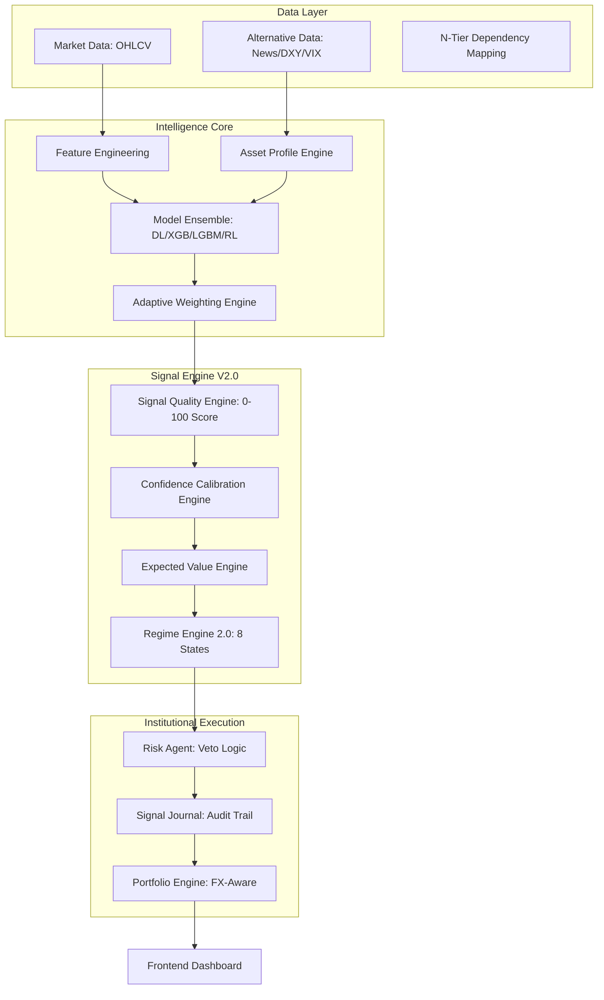

# 🐉 Hydra Terminal: Universal Multi-Asset Intelligence Platform

[](https://www.python.org/downloads/release/python-3120/)
[](https://fastapi.tiangolo.com)
[](https://nextjs.org/)
[](https://www.tensorflow.org/)
[](https://www.typescriptlang.org/)
[](https://opensource.org/licenses/MIT)

Hydra Terminal is an institutional-grade quantitative research workstation and universal signal intelligence platform. Built for precision and selectivity, Hydra transforms raw market data into high-conviction trading signals across multiple asset classes using a multi-agent ensemble architecture and rigorous statistical validation.

## 🚀 Key Capabilities

### Signal Engine V2.0 (Institutional Grade)
*   **0–100 Signal Quality Score:** A unified scoring system that evaluates every signal across 7 layers of confirmation. Only scores > 60 reach the workstation.
*   **Dynamic Model Weighting:** Adaptive rebalancing of model influence (LSTM, XGBoost, LightGBM, DQN) based on current market regime and recent predictive accuracy.
*   **Confidence Calibration:** A sophisticated engine that aligns predicted probabilities with empirical win rates using Brier Scores and ECE metrics.
*   **Multi-Timeframe Consensus:** Real-time alignment checks across Daily, 4H, and 1H intervals to prevent "counter-trend" traps.
*   **Expected Value (EV) Filtering:** Statistical validation where every trade must have a positive mathematical expectancy (`EV > 0`) based on historical average gains and losses.

### Portfolio & Risk Systems
*   **FX-Normalized Accounting:** Real-time multi-currency support (USD, INR, EUR, GBP) with institutional-grade FX conversion.
*   **Risk Veto System:** Specialized Risk Agents with absolute power to suppress signals failing VaR, Crowding (Stampede), or Volatility checks.
*   **Full Kelly Sizing:** Dynamic position sizing optimized for capital preservation and growth.

### Validation Framework
*   **Signal Journal V2:** Persistent high-fidelity logging of every generated signal, calibrated probability, and market condition for post-trade analysis.
*   **Performance Research Hub:** In-depth analytics tracking Win Rate, Profit Factor, and Sharpe ratios segmented by Quality Score buckets.

## 📊 Supported Asset Classes

Hydra Terminal provides **Asset-Specific Intelligence**, meaning it applies unique alpha drivers depending on the asset profile:

| Class | Highlights | Verified Assets |
| :--- | :--- | :--- |
| **Equities** | Earnings Windows, Sector Rotation, Market Breadth | AAPL, TSLA, RELIANCE.NS, NIFTY 50 |
| **Commodities** | DXY Correlation, Inflation Hedges, Real Yields | Gold (GC=F), Silver, Crude Oil, Copper |
| **Crypto** | Funding Rates, Stablecoin Flows, Network Activity | BTC, ETH, SOL, BNB, XRP |
| **Forex** | Interest Rate Differentials, Yield Curves | EURUSD, GBPUSD, USDJPY, USDINR |
| **Indices** | Global Sentiment, Volatility Clustering | S&P 500, NASDAQ, DAX, FTSE |

## 🏗 Architecture



## 🛠 Installation

### Prerequisites
*   **Python 3.12+**
*   **Node.js 20+**
*   **Git**

### 1. Backend Setup
```bash
cd backend
python -m venv venv
source venv/bin/activate  # Windows: .\venv\Scripts\activate
pip install -r requirements.txt
```

### 2. Environment Configuration
Create a `.env` file in the `backend/` directory:
```bash
API_KEY=your_institutional_key
FRONTEND_URL=http://localhost:3000
GOOGLE_API_KEY=your_gemini_api_key
```

### 3. Frontend Setup
```bash
cd frontend
npm install
```

## 🚦 Running Hydra

### Start Backend
```bash
cd backend
$env:PYTHONPATH='.'  # PowerShell
python api.py
```

### Start Frontend
```bash
cd frontend
npm run dev
```

### Institutional Commands
*   **System Audit:** `python backend/scripts/ops/generate_report.py --audit`
*   **Signal Learning:** `python backend/scripts/ops/analyze_signals.py`
*   **Clean Artifacts:** `python backend/scripts/ops/clean_artifacts.py`

## 📁 Repository Structure
*   `backend/src/execution/`: Core Signal Engine V2.0, Risk, and Portfolio logic.
*   `backend/src/models/`: Multi-agent ensemble (Neural, Boosting, RL).
*   `backend/src/data_ingestion/`: Multi-modal data fetching and GNN mappings.
*   `frontend/app/`: Next.js 16.2 Institutional Command Center.
*   `docs/`: Detailed technical specifications and implementation reports.

## 🗺 Roadmap
- [ ] **Signal Quality Optimization:** Refining the 7-layer confirmation thresholds.
- [ ] **Adaptive Portfolio Construction:** Automated rebalancing based on regime-specific win rates.
- [ ] **Live Validation Dataset Growth:** Expanding the Signal Journal for 10k+ verified trade outcomes.
- [ ] **Advanced Regime Research:** Integrating HMM-based volatility clustering for micro-regime detection.

---
**Hydra Terminal** — built for precision, grounded in data, executed by agents.
