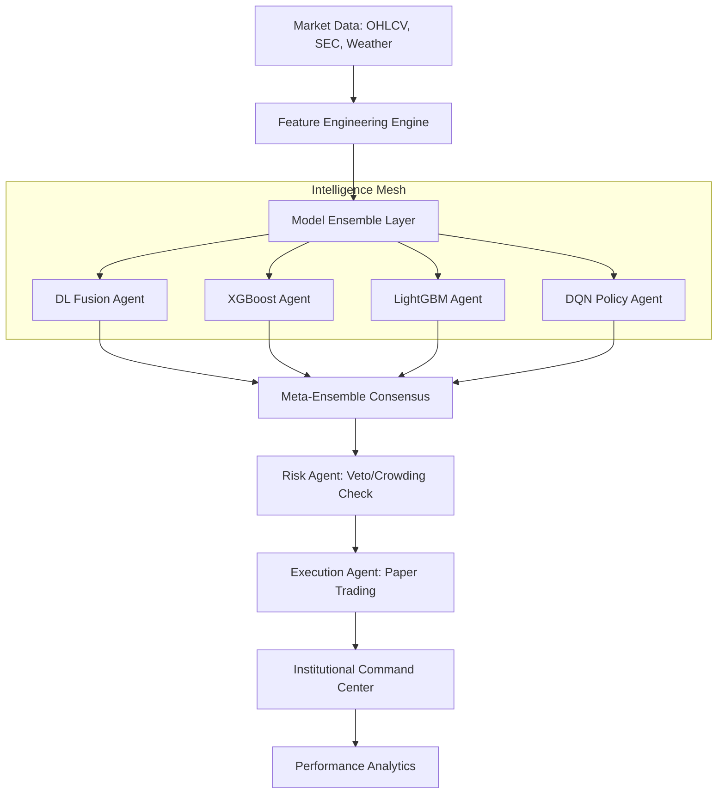

# Hydra Terminal

[](https://github.com/dhruvin0041/stock-indicator-buy-sell/actions)
[](https://fastapi.tiangolo.com/)
[](https://nextjs.org/)
[](https://www.python.org/)
[](https://www.typescriptlang.org/)
[](https://opensource.org/licenses/MIT)

Hydra Terminal is a State-of-the-Art (SOTA) 2026 quantitative trading and market intelligence system. It operates as a decentralized multi-agent mesh designed for institutional-grade alpha discovery, risk management, and execution simulation.

The system fuses deep learning (LSTM/CNN), gradient boosting (XGBoost/LightGBM), and reinforcement learning (DQN) with real-world physical proxies (Weather/Supply Chain) and qualitative LLM-driven alpha (Gemini 2.0) to deliver high-conviction trading signals across global markets.

---

## 📑 Table of Contents

- [Key Features](#key-features)
- [Architecture](#architecture)
- [Technology Stack](#technology-stack)
- [Multi-Market & Currency](#multi-market--currency)
- [Intelligence & Signal Generation](#intelligence--signal-generation)
- [Risk Management](#risk-management)
- [Installation & Local Development](#installation--local-development)
- [Environment Configuration](#environment-configuration)
- [Project Structure](#project-structure)
- [License & Disclaimer](#license--disclaimer)

---

## ✨ Key Features

- **Agentic Consensus Mesh**: Alpha, Risk, and Execution agents negotiate trades with absolute Veto power for the Risk Agent.
- **Hybrid Intelligence**: Ensemble fusion of Deep Learning, GBDT, and RL policies calibrated for regime-aware execution.
- **Multi-Market Support**: Native support for U.S. (NYSE/NASDAQ) and Indian (NSE) universes with structured metadata.
- **FX Normalization**: Real-time FX engine (USD/INR/EUR/GBP) for true cross-market portfolio accounting.
- **Physical Alpha Proxies**: Supply chain risk detection via real-time weather coordinates for global ports and Google Trends proxies.
- **Explainable AI (XAI)**: Full mathematical transparency using SHAP to log the primary drivers behind every decision.
- **Institutional Paper Trading**: Precision simulation with 0.05% slippage, Kelly sizing, and multi-currency equity tracking.
- **Data Integrity Audit**: Systematic "Zero-State" protocol and calibration audits to prevent neural pathway contamination.

---

## 🏗 Architecture

Hydra Terminal follows a strictly decoupled, modular architecture designed for high-performance financial execution.

### System Flow


---

## 🛠 Technology Stack

### Backend (`backend/`)
- **Framework**: FastAPI (Async-first)
- **ML/AI**: TensorFlow 2.16, Keras, XGBoost, LightGBM, Scikit-learn
- **RL**: PyTorch (DQN Implementation)
- **LLM**: Google Gemini 2.0 Flash (Qualitative Alpha)
- **Data**: YFinance, Pandas, NumPy, Numba (High-performance paths)
- **Monitoring**: Prometheus, MLflow (Experiment tracking)

### Frontend (`frontend/`)
- **Framework**: Next.js 16.2 (App Router)
- **Language**: TypeScript (Strict Typing)
- **Styling**: Tailwind CSS (Intrinsic Sizing Model)
- **Charts**: Lightweight-Charts v5+ (Institutional Visuals)
- **Components**: Radix UI, Shadcn/ui

---

## 🌍 Multi-Market & Currency

The system is engineered for global portfolio management:

- **Global Universes**:
  - **USA**: 20+ High-liquidity tickers (AAPL, MSFT, NVDA, etc.)
  - **India**: 20+ Nifty 50 benchmarks (RELIANCE.NS, TCS.NS, etc.)
- **FX Normalization**: The `FXEngine` provides real-time conversion into the user-defined base currency, enabling seamless PnL tracking for cross-border trades.

---

## 🧠 Signal Intelligence

Signal generation is driven by **Multi-Agent Consensus**:

1.  **Deep Learning Fusion**: Combines time-series sequences with peer asset correlations.
2.  **GBDT Ensemble**: High-precision tabular feature extraction via XGBoost and LightGBM.
3.  **DQN Policy**: Optimizes sequential decision-making (Buy/Sell/Hold) based on current state and historical feedback.
4.  **Qualitative Alpha**: Gemini 2.0 analyzes SEC filings (8-K/10-Q) and news context for "moving targets" and litigious risks.

---

## 🛡 Risk Management

The Risk Agent has absolute authority to suppress signals based on institutional guardrails:

- **Kelly Criterion**: Optimal position sizing scaled by model confidence.
- **Jensen's Alpha**: Measuring skill vs. market beta.
- **Stampede Risk**: Detecting crowded trades via retail sentiment volatility.
- **Regime Veto**: Hard conviction thresholds enforced during BEAR vs. BULL regimes.
- **Standard Filters**: Volatility (ATR) ratios and earnings window suppression.

---

## 🚀 Installation & Local Development

### Prerequisites
- Python 3.12+
- Node.js 20+
- Google Gemini API Key (Optional, for Qualitative Alpha)

### 1. Repository Setup
```bash
git clone https://github.com/dhruvin0041/stock-indicator-buy-sell.git
cd stock-indicator-buy-sell
```

### 2. Backend Setup
```bash
cd backend
python -m venv venv
source venv/bin/activate  # venv\Scripts\activate on Windows
pip install -r requirements.txt
```

### 3. Frontend Setup
```bash
cd ../frontend
npm install
```

---

## ⚙️ Environment Configuration

Create a `.env` file in the `backend/` directory:

| Variable | Description |
| :--- | :--- |
| `API_KEY` | Your unique Hydra API Key (required) |
| `GOOGLE_API_KEY` | Google Gemini API Key (optional) |
| `FRONTEND_URL` | Comma-separated list of allowed origins (default: http://localhost:3000) |

---

## 🖥 Local Development

### Running the Backend
```bash
cd backend
python api.py
```
The API will be available at `http://localhost:8000`. Explore the interactive documentation at `/docs`.

### Running the Frontend
```bash
cd frontend
npm run dev
```
The terminal dashboard will be available at `http://localhost:3000`.

---

## 📂 Project Structure

```
├── backend/
│   ├── artifacts/          # Trained model weights & scalers
│   ├── configs/            # Risk params & kept features
│   ├── scripts/            # Training, Research & Ops pipelines
│   └── src/
│       ├── agents/         # Multi-agent mesh (Alpha/Risk/Execution)
│       ├── data_ingestion/ # Multi-modal data pipelines
│       ├── execution/      # Paper Trading, FX & Signal Engines
│       └── models/         # Architecture definitions (DL/RL/GBDT)
├── frontend/
│   ├── app/                # Next.js App Router (Dashboard/Performance)
│   └── components/         # Institutional UI (XAI Bars/Charts)
└── docs/                   # Implementation reports & System design
```

---

## 📄 License & Disclaimer

**License**: Distributed under the MIT License. See `LICENSE` for more information.

**Disclaimer**: Hydra Terminal is an educational research platform. Trading stocks involves significant risk. The signals generated by this system are for simulation and research purposes only and do not constitute financial advice. Past performance is not indicative of future results.

---
**Hydra Terminal** — Built for the 2026 market paradigm.
