# Institutional Quantitative Trading Platform

[](https://www.python.org/)
[](https://fastapi.tiangolo.com/)
[](https://nextjs.org/)
[](#)
[](https://github.com/astral-sh/ruff)
[](#verification-suite)

An institutional-grade systematic algorithmic trading, risk management, and quantitative execution platform designed for US equity markets. The system couples multi-modal market data ingestion, 27 stationarized feature pipelines, in-process machine learning signal generation, symmetric macro regime gating, dynamic asset expectancy filters, and Beta-calibrated trailing stop ratchets with a strictly manual on-demand end-of-day (EOD) paper execution engine and full TradingView Pine Script v5 strategy parity.

<p align="center">
  
</p>

---

## 1. Executive Summary & Production Philosophy

The platform operates under a foundational institutional mandate: **Alpha cannot exist without survival, and survival requires absolute empirical realism.**

Rather than deploying unconstrained deep neural networks or publishing unpenalized theoretical backtests, this platform enforces strict quantitative boundaries across all research and execution layers:

1. **Active Production Flagship Configuration**:
   $$\mathbf{Strategy} = \text{Pure XGBoost Alpha Driver} + \text{Symmetric Macro Gating} + \text{Dynamic Asset Expectancy Gate} + \text{Beta-Calibrated ATR Trailing Stops}$$
2. **Strict Causal Temporal Isolation**: All feature transformations, rolling windows, cross-asset comparisons, and performance feedback loops are causally indexed strictly by **realized exit dates**. Overlapping return target lookahead is eliminated via a mandatory 10-day embargo buffer across all walk-forward evaluation slices.
3. **Institutional Execution Friction**: All empirical metrics are reported **net of 12.0 basis points (bps) round-trip drag** (10.0 bps slippage + 2.0 bps exchange/clearing fees), accounting for realistic institutional order fill dynamics.
4. **Pragmatic Model Fleet Hierarchy**: Deep learning architectures subject to secular regime drift (e.g., Deep Learning Fusion exhibiting a 63.4% short bias during a multi-year secular bull market, delivering a -0.19 Net Sharpe) are **systematically quarantined**. Regularized gradient boosted decision trees (XGBoost) serve as the solitary active alpha driver, generating positive expectancy across all audited walk-forward regimes.
5. **Strictly Manual On-Demand Execution**: Automated background schedulers (such as Windows Task Scheduler or cron daemons) have been completely decommissioned. All paper execution cycles and portfolio telemetry inspections are operated on-demand via institutional CLI commands.

---

## 2. Institutional Command Center & Visual Telemetry

The platform features an institutional Next.js 16 command center (**HYDRA V2**) equipped with TradingView Lightweight Charts, real-time risk telemetry, multi-agent consensus transparency, and automated portfolio accounting:

### 2.1 Command Center Interface (Dark & Light Modes)

| Institutional Dark Mode | Daylight High-Contrast Mode |
| :---: | :---: |
|  |  |
| *Institutional Dark Mode — Interactive candlestick charts, real-time buy/sell signal overlays, and live RiskAgent telemetry feed.* | *Daylight High-Contrast Mode — Order routing status, real-time portfolio VaR gauge, and sector crowding monitors.* |

### 2.2 Real-Time Consensus & Risk Analytics Panels

| Multi-Agent Model Consensus | Institutional Risk Engine |
| :---: | :---: |
|  |  |
| **Model Consensus**: Real-time vote matrix displaying individual model predictions, conviction confidence, ensemble weighting, and the Risk Agent's absolute veto authority. | **Risk Engine**: Multi-dimensional risk monitoring covering Half-Kelly position sizing, 95% VaR / CVaR limits, market regime status, and historical peak/trough drawdown. |

| Portfolio Management & Capital Allocation | Technical Indicators & Regime Detection |
| :---: | :---: |
|  |  |
| **Portfolio Accounting**: Real-time equity tracking, available liquidity reserves, daily/YTD PnL, realized vs. unrealized gains, and cash allocation bounds. | **Technical Analytics**: Quant indicators including 14-period RSI/Stochastic RSI, ADX trend strength, moving average alignment, ATR volatility regimes, and volume accumulation. |

---

## 3. End-to-End System Architecture

The following diagram maps the complete quantitative execution pipeline from market data ingestion through multi-layer filtering, in-process machine learning inference, capital allocation, and SQLite state persistence:

```mermaid
flowchart TD
    subgraph Data_Layer ["1. Ingestion & Stationarization"]
        MD["Daily OHLCV Data: Universe (AAPL, MSFT, NVDA)"] --> Sync["DropNA & Causal Time Synchronization"]
        BM["Macro Benchmarks: SPY (S&P 500), ^VIX, ^TNX"] --> Sync
        Sync --> FE["Stationarized Feature Pipeline: 27 Z-Scores, Spreads & Regimes"]
    end

    subgraph Layer1 ["2. Layer 1: Trend Alignment & Macro Directional Filter"]
        FE --> MacroEval{"Macro Regime & Trend Alignment"}
        MacroEval -->|"Fast MA > Slow MA & Slopes > 0 & Close > Slow MA & SPY >= SMA50"| LongPermitted["BUY / Long Allowed: True"]
        MacroEval -->|"Close > Slow MA (Hard Short Prohibition)"| ShortProhibited["SELL / Short Strictly Prohibited"]
        MacroEval -->|"Close < Slow MA & Fast MA < Slow MA & Slope(Slow) < 0"| ShortPermitted["SELL / Short Allowed: True"]
    end

    subgraph Layer2 ["3. Layer 2: State-Machine Cooldown & Refractory Memory"]
        LongPermitted --> CooldownCheck{"Cooldown Evaluation"}
        ShortPermitted --> CooldownCheck
        CooldownCheck -->|"Exit Triggered on Current Bar (exit_triggered_this_bar)"| SuppressSameBar["Suppress Same-Bar Re-entry: HOLD"]
        CooldownCheck -->|"(Bar - last_exit_bar) < cooldown_bars"| PostStopCooldown["Post-Stop Refractory Lockout: HOLD"]
        CooldownCheck -->|"(Bar - last_entry_bar) < cooldown_bars"| EntryCooldown["Clustering Prevention Lockout: HOLD"]
        CooldownCheck -->|"All Cooldown Gates Clear"| AdmittedSignal["Admitted Candidate Signal"]
    end

    subgraph Model_Layer ["4. In-Process Model Inference Engine"]
        AdmittedSignal --> Inf["In-Process ModelManager: artifacts/xgb_ensemble.json"]
        Inf --> ProbDist["P(SELL), P(HOLD), P(BUY) via xgb_model.predict_proba()"]
        ProbDist --> FlagshipGate{"Pure XGBoost Flagship: P(Action) >= 0.60?"}
        FlagshipGate -->|No| HoldAction["Emit HOLD"]
        FlagshipGate -->|Yes| RawAction["Emit Raw Direction: BUY / SELL"]
        Inf -.->|Optional --use-veto| VetoCheck{"Asymmetric Veto (LGBM / DQN)"}
        VetoCheck -.->|Conviction >= 0.65 Counter-Trend| Vetoed["Veto Override: Suppress to HOLD"]
    end

    subgraph Expectancy_Layer ["5. Asset-Level Expectancy Filter"]
        RawAction --> ExpCheck{"AssetExpectancyFilter: Rolling 90d PF"}
        ExpCheck -->|"PF < 1.15 (N >= 3 Realized Trades)"| SuspendAsset["Suspend Asset: Emit HOLD"]
        ExpCheck -->|"Suspended & PF < 1.20"| StaySuspended["Maintain Hysteresis Lockout: Emit HOLD"]
        ExpCheck -->|"PF >= 1.15 or Recovery >= 1.20"| ActionableSignal["Actionable Entry Signal"]
    end

    subgraph Sizing_Layer ["6. Multi-Signal Capital Allocation & Beta Stops"]
        ActionableSignal --> Ranker["Conviction Sorter: Sort by Agreement Score Descending"]
        Ranker --> ConcurCap["Concurrency Ceiling: Max 2 Concurrent Positions"]
        ConcurCap --> CashPool["Capital Pool: Max 80% Portfolio Equity Cap"]
        CashPool --> VolSize["ATR Volatility Position Sizing (1% Target Risk)"]
        VolSize --> BetaCalib["Beta-Calibrated Stop Multiplier: ts_mult = clip(2.5 * max(1.0, beta_20d), 2.5, 4.0)"]
    end

    subgraph Execution_Layer ["7. Broker Execution & SQLite State Persistence"]
        BetaCalib --> BrokerAdapter["MockPaperBroker (10 bps Slippage)"]
        BrokerAdapter --> FillOrder["Order Fill Execution"]
        FillOrder --> SaveStop["Ratcheted Stop Persistence: trailing_stops Table"]
        SaveStop --> SaveRun["Daily Cycle Audit Log: daily_execution_runs Table"]
        SaveRun --> ReadOnlyCLI["Telemetry CLI: python -m backend.execution.paper_runner --status"]
    end
```



---

## 4. The 3-Layer Quantitative Architecture

The core trading and signal evaluation engine operates as a sequential three-layer state machine engineered to eradicate three universal quantitative failure modes: counter-trend whipsaws, duplicate signal clustering during consolidations, and premature peak-fading stop exits.

```
┌────────────────────────────────────────────────────────────────────────┐
│              LAYER 1: TREND ALIGNMENT & MACRO REGIME FILTER            │
│  - Dual EMA Hierarchy (Fast 12 > Slow 24)                              │
│  - Multi-bar Momentum Slope Confirmation: slope(MA) = MA_t - MA_{t-k}  │
│  - Close > Slow MA Gating (Hard Short Prohibition while Close > Slow)  │
│  - Macro Market Benchmark Gating: SPY >= SMA_50 & Underlying >= SMA_200│
└───────────────────────────────────┬────────────────────────────────────┘
                                    │
                                    ▼
┌────────────────────────────────────────────────────────────────────────┐
│          LAYER 2: STATE-MACHINE COOLDOWN & REFRACTORY MEMORY           │
│  - Isolation: exit_triggered_this_bar suppresses same-bar re-entry     │
│  - Post-Stop Refractory Cooldown: lockout while (t - last_exit_bar) < 7│
│  - Intra-Direction Refractory Period: (t - last_entry_bar) >= 7 bars   │
│  - Eliminates duplicate entries and knife-catching during cascades    │
└───────────────────────────────────┬────────────────────────────────────┘
                                    │
                                    ▼
┌────────────────────────────────────────────────────────────────────────┐
│         LAYER 3: DYNAMIC ATR-RATCHETING TRAILING STOPS (BIDIRECTIONAL)  │
│  - Long Stops Ratchet Monotonically UP: Stop_t = max(Stop_{t-1}, High-D)│
│  - Short Stops Ratchet Monotonically DOWN: Stop_t = min(Stop_{t-1}, Low+D)│
│  - Beta-Calibrated Distance: ts_mult = clip(2.5 * max(1.0, beta_20d), 2.5, 4.0)│
│  - Uncapped Profit Run; Strictly Capped Downside & Upside Tail Risk    │
└────────────────────────────────────────────────────────────────────────┘
```

### 4.1 Layer 1: Trend Alignment & Macro Directional Filter
Eliminates counter-trend whipsaws by strictly enforcing moving average hierarchy, directional slope momentum, and broad market benchmark alignment:

* **Moving Average Definitions**:
  - `fast_ma` = 12-period Exponential Moving Average (Orange)
  - `slow_ma` = 24-period Exponential Moving Average (Blue)
* **Momentum Slope Calculation**: Computed over a lookback window $k$ ($k = 3$ bars):
  $$\text{slope}(MA) = MA_t - MA_{t-k} > 0$$
* **Long Entry Filter**: A `BUY` signal is valid **only if all four conditions hold**:
  1. `fast_ma > slow_ma` (Moving Average Bullish Hierarchy)
  2. $\text{slope}(\text{fast\_ma}) > 0$ and $\text{slope}(\text{slow\_ma}) > 0$ (Dual Positive Momentum)
  3. $\text{Close} > \text{slow\_ma}$ (Price Confirmation)
  4. $\text{SPY} \ge \text{SMA}_{50}(\text{SPY})$ and $\text{Close} \ge \text{SMA}_{200}(\text{Close})$ (Macro Market Uptrend)
* **Short Entry Filter**:
  - **Hard Prohibition**: All `SELL` / Short signals are **strictly suppressed** while $\text{Close} > \text{slow\_ma}$.
  - A `SELL` signal is valid **only if**:
    $$\text{Close} < \text{slow\_ma} \quad \text{AND} \quad \text{fast\_ma} < \text{slow\_ma} \quad \text{AND} \quad \text{slope}(\text{slow\_ma}) < 0$$
    alongside a confirmed macro breakdown ($\text{Close} < \text{SMA}_{200}$ or $\text{SPY} < \text{SMA}_{50}$).

### 4.2 Layer 2: State-Machine Cooldown & Refractory Memory
Eliminates duplicate signal clustering during consolidations and prevents knife-catching post-stopout:

* **Loop-Scoped Bar Isolation (`exit_triggered_this_bar`)**:
  - Initialized to `False` at the beginning of each bar index $t$.
  - When either a long or short trailing stop is breached, `exit_triggered_this_bar` is set to `True`.
  - Added as an explicit guard condition to all entry blocks (`BUY` and `SELL`), eliminating same-bar exit-and-reentry.
* **True Post-Exit Refractory Cooldown (`last_exit_bar`)**:
  - Tracks the exact bar index when a trade is stopped out: `last_exit_bar = t`.
  - Locks out all subsequent entries until a refractory period of `cooldown_bars` ($k = 7$ bars) has elapsed:
    $$\text{post\_exit\_ok} = (t - \text{last\_exit\_bar}) \ge \text{cooldown\_bars}$$
* **Intra-Direction Refractory Tracking**:
  - Maintains `last_long_bar` and `last_short_bar` state across bars.
  - Prevents pyramiding into an existing position in the same direction within 7 bars.

### 4.3 Layer 3: Dynamic ATR-Ratcheting Trailing Stops (Bidirectional)
Protects unrealized open gains while guaranteeing that both long and short positions maintain strictly bounded downside and upside tail risk:

* **Long Trailing Stops (Monotonically Non-Decreasing)**:
  - Initialized at entry: $\text{Stop}_0 = \text{Fill Price} - (\text{ts\_mult} \times \text{ATR}_{14})$.
  - On each subsequent bar, the stop ratchets upward with new market highs and never widens:
    $$\text{Stop}_t = \max\left(\text{Stop}_{t-1}, \; \text{High}_t - \text{ts\_mult} \times \text{ATR}_{14}\right)$$
* **Short Trailing Stops (Monotonically Non-Increasing)**:
  - Initialized at entry: $\text{Short Stop}_0 = \text{Fill Price} + (\text{ts\_mult} \times \text{ATR}_{14})$.
  - On each subsequent bar, the stop ratchets downward with new market lows and never loosens upward:
    $$\text{Short Stop}_t = \min\left(\text{Short Stop}_{t-1}, \; \text{Low}_t + \text{ts\_mult} \times \text{ATR}_{14}\right)$$
  - Eliminates uncapped short risk; all short positions carry dynamic, guaranteed upside boundaries.

---

## 5. Beta-Calibrated Trailing Stops

Earlier trailing stop formulations scaled distance using an asset-to-index volatility standard deviation ratio ($\sigma_{\text{asset}} / \sigma_{\text{SPY}}$). Because raw single-stock equity volatility naturally exceeds diversified index volatility by $> 1.60\times$, this caused all universe assets (AAPL, MSFT, NVDA) to hit the maximum $4.00\times$ multiplier ceiling simultaneously.

The platform resolves this distortion by replacing raw standard deviation with the **rolling 20-day returns Beta against SPY**:

### 5.1 Mathematical Formulation
$$\beta_{20\text{d}} = \frac{\text{Cov}_{20\text{d}}(R_{\text{asset}}, \; R_{\text{SPY}})}{\text{Var}_{20\text{d}}(R_{\text{SPY}}) + 10^{-9}}$$

$$\text{ts\_mult} = \text{clip}\left(2.5 \times \max(1.0, \; \beta_{20\text{d}}), \; 2.5, \; 4.0\right)$$

$$\text{Stop Distance} = \text{ts\_mult} \times \text{ATR}_{14}$$

### 5.2 Volatility Calibration Profile
* **Low-Beta Defensive Drift ($\beta \le 1.00$)**: Clamped to the institutional minimum base of **$2.50\times$ ATR**. Prevents giving back profits on slow-moving trends.
* **Median Tech Equities ($\beta \approx 1.20$)**: Scales dynamically to approximately **$3.00\times$ ATR** (e.g., MSFT calibrated at $3.01\times$), providing adequate breathing room through routine pullbacks without premature stopouts.
* **High-Beta Momentum ($\beta \ge 1.60$)**: Expands to the maximum ceiling of **$4.00\times$ ATR** (e.g., NVDA calibrated at $4.00\times$), accommodating aggressive volatility expansions while maintaining strict structural risk containment.

---

## 6. Dynamic Asset Expectancy Filter (`AssetExpectancyFilter`)

Even a positive-expectancy strategy can suffer prolonged capital bleed on individual assets undergoing volatile mean-reversion or regime decoupling (e.g., choppy sideways consolidations).

The `AssetExpectancyFilter` enforces an automated performance circuit breaker by tracking the rolling 90-day realized out-of-sample Profit Factor (PF) per asset:

$$\text{PF}_{90\text{d}} = \frac{\sum \text{Realized Gains}}{\sum |\text{Realized Losses}|} \quad \forall \; \text{trades where } \text{exit\_date} \in [t - 90\text{d}, \; t]$$

```
          [Normal Trading Permitted]
                     │
         PF drops < 1.15 (N >= 3)
                     │
                     ▼
          [Asset Entry SUSPENDED]
                     │
         PF recovers >= 1.20 (or aged losses roll off)
                     │
                     ▼
          [Asset Entry RECOVERED]
```

* **Suspension Trigger**: If an asset's trailing 90-day PF drops below **1.15** (with a minimum sample size of 3 realized trades), new entry signals for that ticker are automatically suspended to `HOLD`.
* **Recovery Hysteresis**: To prevent erratic signal toggling at the boundary, a suspended asset must demonstrate a trailing PF of $\ge \mathbf{1.20}$ (or allow aged losses to roll out of the 90-day lookback) before new entries are cleared.
* **Strict Causal Realized Exit-Date Indexing**: Trades are logged strictly upon their **realized exit date**, ensuring zero lookahead leakage into active trading decisions.

---

## 7. Audited Walk-Forward Benchmark (Ground Truth)

All configurations were evaluated under an identical, strictly causal walk-forward test harness across the core US equity universe:
* **Evaluation Window**: January 1, 2024 – May 1, 2026 (2.33 simulation years, 1,785 daily bars).
* **Multi-Ticker Universe**: AAPL, MSFT, NVDA. Macro benchmarks: SPY, ^VIX, ^TNX.
* **Training Window**: 2-year rolling window retrained monthly.
* **Purged Embargo Gap**: 10-day strict temporal buffer between train and test slices to eliminate forward-return label bleed.
* **Execution Friction**: **12.0 bps round-trip friction** (10.0 bps slippage + 2.0 bps exchange/clearing fees).

### 7.1 Audited Walk-Forward Ablation Matrix

| Strategy / Ablation Mode | Total Trades | Net Win Rate | Net Profit Factor | Net Sharpe | Net Max Drawdown | Net Calmar | 95% Bootstrap CI (PF) | $P(\text{PF} > 1.2)$ | Operational Status |
| :--- | :---: | :---: | :---: | :---: | :---: | :---: | :---: | :---: | :--- |
| **Pure XGBoost Flagship (Audited)** | **50** | **52.0%** | **1.28** | **1.50** | **-11.5%** | **0.35** | **[1.02, 1.58]** | **57.8%** | **PRIMARY FLAGSHIP (Production Default)** |
| Bidirectional Asymmetric Veto | 48 | 50.0% | 1.04 | 0.24 | -16.6% | 0.05 | [0.81, 1.31] | 24.3% | Secondary Option (`--use-veto`) |
| Symmetric Strict Consensus | 22 | 50.0% | 1.08 | 0.44 | -10.9% | 0.11 | [0.77, 1.45] | 29.8% | Over-constrained, alpha starved |
| Pure LightGBM (Regularized) | 48 | 45.8% | 1.03 | 0.15 | -22.3% | 0.03 | [0.80, 1.29] | 24.7% | High leaf variance |
| Pre-trained DL Fusion (Causal) | 587 | 45.1% | 0.97 | -0.19 | -48.7% | -0.01 | [0.89, 1.06] | 14.8% | **QUARANTINED (Capital Destroyer)** |
| Pre-trained DQN Agent (Causal) | 380 | 46.8% | 1.07 | 0.43 | -41.7% | 0.08 | [0.97, 1.18] | 31.2% | **RESEARCH ONLY (Extreme Drawdown)** |
| Dynamic Performance Consensus | 49 | 49.0% | 1.05 | 0.28 | -16.6% | 0.06 | [0.82, 1.33] | 25.5% | Dilutes XGBoost edge |
| Bayesian Meta-Ensemble | 49 | 49.0% | 1.05 | 0.28 | -16.6% | 0.06 | [0.82, 1.33] | 25.5% | Overparameterized stacking drag |

### 7.2 Per-Ticker Performance Breakdown (Pure XGBoost Flagship)

| Ticker | Round-Trip Trades | Net Win Rate | Net Profit Factor | Net Realized PnL | Avg Holding Period | Risk Assessment & Gating Impact |
| :--- | :---: | :---: | :---: | :---: | :---: | :--- |
| **AAPL** | 17 | **64.7%** | **2.96** | **+12.27%** | 3.4 days | High-conviction alpha driver; clean trend capture. |
| **MSFT** | 7 | **42.9%** | **2.02** | **+4.79%** | 4.1 days | Strong profit factor driven by asymmetric win/loss sizing. |
| **NVDA** | 26 | **46.2%** | **0.86** | **-7.62%** | 2.8 days | Capital bleed reduced by 47% via `AssetExpectancyFilter`. |
| **Total** | **50** | **52.0%** | **1.28** | **+9.44%** | **3.3 days** | **Net Sharpe: 1.50 \| Net MaxDD: -11.5% \| Net Calmar: 0.35** |

### 7.3 Root Cause of the "Resurrection Paradox" (Causal Audit)
In earlier unpurged simulations, DL Fusion and DQN erroneously reported Sharpe ratios of +2.48 and +3.87. A forensic code audit unmasked this as **forward return lookahead leakage**:
1. Previous test harnesses recorded trades at the **entry bar $d$** along with the trade's forward outcome.
2. On bar $d+1$, the expectancy filter observed this realized forward loss before the trade had reached its actual exit date ($d+h$), prematurely tripping the expectancy gate and acting as an accidental **oracle stop-loss** for high-frequency signal bursts.
3. When evaluated under strict **exit-date indexing**, the illusion vanished: DL Fusion collapsed to Net Sharpe -0.19 and -48.7% MaxDD, while DQN collapsed to -41.7% MaxDD.
4. **Conclusion**: Pure XGBoost is the platform's solitary robust alpha source and is the default production engine.

---

## 8. Model Fleet & Registry Hierarchy

All quantitative models are governed via an institutional role hierarchy in `MODEL_REGISTRY`:

```python
class ModelRole(str, Enum):
    PRIMARY_ALPHA_DRIVER = "PRIMARY_ALPHA_DRIVER"
    SECONDARY_VETO       = "SECONDARY_VETO"
    FORECAST_ORACLE      = "FORECAST_ORACLE"
    QUARANTINED          = "QUARANTINED"
```

| Model Identifier | Architecture & Parameters | Training Methodology | Assigned Role | Production Status | Threshold Mandate |
| :--- | :--- | :--- | :--- | :---: | :--- |
| **`XGB_AGENT`** | Gradient Boosted Decision Trees (`n_estimators=100`, `max_depth=4`, `lr=0.05`, `objective=multi:softprob`) | Monthly rolling 2-year retrain with 10-day embargo gap | `PRIMARY_ALPHA_DRIVER` | **ACTIVE** | $P(\text{BUY}) \ge 0.60$ triggers trade entry. |
| **`LGBM_AGENT`** | Leaf-Wise Regularized GBDT (`num_leaves=15`, `min_child_samples=50`, `feature_fraction=0.8`, `bagging_fraction=0.8`) | Monthly rolling 2-year retrain with 10-day embargo gap | `SECONDARY_VETO` | **ACTIVE** | Enabled via `--use-veto`. Vetoes if $P(\text{Dissent}) \ge 0.65$. |
| **`DQN_AGENT`** | Dueling Double Deep Q-Network (PyTorch, Huber loss, prioritized experience replay) | Offline RL on tabular features + tree probabilities | `SECONDARY_VETO` | **RESEARCH ONLY** | Restricted to research due to -41.7% MaxDD. |
| **`DL_FUSION`** | 6-Branch Cross-Modal Attention Network (LSTM, CNN, Transformer, TCN, PatchTST, Peer Context) | Multi-task backpropagation with Huber & Cross-Entropy | `QUARANTINED` | **QUARANTINED** | Weight set to 0.0. Completely bypassed in inference service. |
| **`TFT_AGENT`** | Temporal Fusion Transformer (Quantile Forecaster) | Pre-trained quantile regression (`p10, p25, p50, p75, p90`) | `FORECAST_ORACLE` | **ACTIVE** | Projects price trajectory boundaries for EV verification. |

### 8.1 In-Process Live Inference Engine
To eliminate network latency and external server dependencies during production runs, `backend/execution/paper_runner.py` directly loads serialized artifacts in-process:
* `artifacts/xgb_ensemble.json` (Primary XGBoost model weights)
* `artifacts/lgbm_agent.joblib` (Secondary LightGBM veto model)
* `artifacts/latest_scaler.joblib` (Production RobustScaler instance)
* `configs/kept_features.json` (Canonical 27 stationary feature schema)

When executed, the runner extracts the latest causal feature vector, applies normalization, and computes live continuous probability distributions $[P(\text{SELL}), P(\text{HOLD}), P(\text{BUY})]$ via `xgb_model.predict_proba()` without relying on mock fallbacks.

---

## 9. Multi-Signal Capital Allocation & Broker Execution

The execution layer decouples strategy logic from broker venues using an abstract adapter:

### 9.1 Broker Interface Layer (`BaseBrokerAdapter`)
* **`BaseBrokerAdapter`**: Standardized abstract interface requiring implementations for `get_account_balance()`, `get_positions()`, `submit_order()`, and `cancel_order()`.
* **`MockPaperBroker`**: Production-grade institutional paper execution broker:
  * Simulates real-world execution with **10.0 bps per-side slippage** on market orders.
  * Real-time accounting for cash, equity, buying power, and position tracking.
  * Atomic state persistence to SQLite database storage (`paper_trading.db`).

### 9.2 Multi-Signal Capital Allocation (`paper_runner.py`)
When multiple universe assets trigger simultaneous entry signals, the runner applies institutional capital allocation rules:
1. **Conviction Ranking**: All candidate entry signals are sorted descending by conviction score (`agreement_score`).
2. **Concurrent Position Cap**: Enforces `max_concurrent_positions = 2` (default). Excess signals beyond available slots are dropped:
   $$\text{Available Slots} = \max\left(0, \; \text{Max Concurrent} - \text{Active Open Positions}\right)$$
3. **Proportional Cash Allocation**: Deployable portfolio capital is bounded at a maximum of 80% total portfolio equity:
   $$\text{Available Capital Pool} = \min\left(\text{Cash}, \; \text{Equity} \times 0.80 - \text{Current Invested}\right)$$
   $$\text{Capital Per Candidate} = \frac{\text{Available Capital Pool}}{\text{Admitted Candidates}}$$
4. **Buying Power Validation**: Order size $Q = \lfloor \min(\text{VolCapital}, \; \text{AllocatedCapital}) / \text{Price} \rfloor$ is validated against available cash to prevent margin exhaustion.
5. **Conflict Resolution**: If an asset is already held in the same direction, pyramiding is suppressed. If an opposing signal is received, the conflicting position is closed before opening the new direction.

### 9.3 SQLite Persistence Schema
Execution state is maintained across cycles using SQLite database storage (`backend/data/paper_trading.db`):

```sql
-- Track completed daily runner execution cycles
CREATE TABLE IF NOT EXISTS daily_execution_runs (
    run_id TEXT PRIMARY KEY,
    run_date TEXT NOT NULL,
    timestamp TEXT NOT NULL,
    cash REAL NOT NULL,
    equity REAL NOT NULL,
    positions_count INTEGER NOT NULL,
    orders_count INTEGER NOT NULL,
    summary_json TEXT NOT NULL
);

-- Persist active volatility-adaptive trailing stops
CREATE TABLE IF NOT EXISTS trailing_stops (
    symbol TEXT PRIMARY KEY,
    side TEXT NOT NULL,
    entry_price REAL NOT NULL,
    peak_trough_price REAL NOT NULL,
    stop_price REAL NOT NULL,
    ts_mult REAL NOT NULL,
    trail_mult REAL,
    atr REAL NOT NULL,
    updated_at TEXT NOT NULL
);

-- Broker account liquidity metrics
CREATE TABLE IF NOT EXISTS broker_account (
    key TEXT PRIMARY KEY,
    value TEXT
);

-- Broker open positions
CREATE TABLE IF NOT EXISTS broker_positions (
    symbol TEXT PRIMARY KEY,
    qty REAL,
    side TEXT,
    avg_entry_price REAL,
    current_price REAL,
    stop_loss REAL,
    take_profit REAL
);

-- Institutional compatibility views
CREATE VIEW IF NOT EXISTS positions AS
SELECT symbol, qty, side, avg_entry_price, current_price, stop_loss, take_profit
FROM broker_positions;
```

---

## 10. Pine Script v5 Strategy Parity (`Hydra_Institutional_Strategy.pine`)

To ensure seamless institutional execution reconciliation between the Python algorithmic backend and TradingView charting, the complete 3-Layer Quantitative Architecture is implemented in TradingView Pine Script v5 (`docs/Hydra_Institutional_Strategy.pine`):

### 10.1 Key Algorithmic Parity Features
* **Layer 1 Trend Filter**: Evaluates 12 EMA (`fast_ma`) and 24 EMA (`slow_ma`) along with 3-bar momentum slopes (`fast_ma - fast_ma[3]` and `slow_ma - slow_ma[3]`). Completely suppresses short entries while `Close > slow_ma`.
* **Layer 2 State-Machine Cooldown**: Tracks `last_exit_bar` upon trade closure (`ta.change(strategy.closedtrades) > 0`) and enforces an identical 7-bar refractory lockout:
  ```pinescript
  if ta.change(strategy.closedtrades) > 0
      last_exit_bar := bar_index
  post_exit_ok = (bar_index - last_exit_bar) >= cooldown_bars
  ```
* **Layer 3 Native Bracket Orders**: Eliminates bar-close exit slippage distortion and execution lag by deploying native bracket stop orders (`strategy.exit("Exit Long", "Long", stop=long_stop)` and `strategy.exit("Exit Short", "Short", stop=short_stop)`). Trailing stops ratchet tick-by-tick upon intra-bar price breaches.
* **Institutional Visual Overlays**: Plots discrete orange/red circle markers (`plot.style_circles`) tracking active trailing stop lines only while a position is open, alongside triangle buy/sell markers and circle stopout badges.

---

## 11. Stationarized Feature Pipeline (27 Kept Features)

Financial time series are non-stationary; training machine learning models directly on raw prices introduces severe regime instability. The platform deflates and stationarizes indicators into **27 core stationary features** (`backend/configs/kept_features.json`):

```json
[
  "MA20_vs_MA50", "EMA9_vs_EMA21", "Price_vs_EMA9", "Price_vs_EMA21",
  "VIX_Level", "BB_Width", "BB_Position", "RSI", "ADX", "MACD_Hist",
  "Relative_Strength", "OBV_Change", "Return", "Volume_Ratio",
  "ZScore_RSI_20", "ZScore_RSI_50", "ZScore_RSI_120",
  "ZScore_BB_Position_20", "ZScore_BB_Position_50",
  "ZScore_MACD_Hist_20", "ZScore_MACD_Hist_50",
  "ZScore_Return_20", "ZScore_Return_50", "ZScore_Return_120",
  "ZScore_Volume_Ratio_20", "ZScore_Volume_Ratio_50",
  "ATR_Regime_Ratio"
]
```

### Feature Categories:
1. **Trend & Moving Average Spreads**: Normalized percentage differences between short- and medium-term trend curves (`Price_vs_EMA9`, `MA20_vs_MA50`).
2. **Normalized Volatility**: Bollinger Band width (`BB_Width`), normalized ATR regime ratio (`ATR_Regime_Ratio`), and broad market volatility (`VIX_Level`).
3. **Momentum & Volume Dynamics**: Relative Strength Index (`RSI`), Average Directional Index (`ADX`), MACD Histogram (`MACD_Hist`), Relative Strength vs SPY, On-Balance Volume change (`OBV_Change`), and Volume Ratio.
4. **Multi-Horizon Rolling Z-Scores**: Stationarizes indicators by measuring deviations from rolling means across 20-day, 50-day, and 120-day horizons:
   $$Z_t = \frac{X_t - \mu_{k}(X)}{\sigma_{k}(X) + 10^{-9}}$$

---

## 12. Manual On-Demand CLI & Operations Guide

The paper trading execution engine is strictly designed for **manual, on-demand CLI execution**. Automated recurring background schedulers (such as Windows Task Scheduler or cron daemons) have been permanently decommissioned to eliminate unattended execution risk.

### 12.1 Execution Commands Reference

All execution commands are run from the project root:

```bash
# 1. Read-Only Portfolio Status Inspection (Sub-second execution: zero models loaded, zero DB mutations)
python -m backend.execution.paper_runner --status

# 2. Dry-Run Mode (Simulated evaluation: live data, feature pipeline, and model inference with zero DB mutations)
python -m backend.execution.paper_runner --dry-run

# 3. Live Paper Execution (Pure XGBoost Flagship: evaluates signals, sizes orders, and updates SQLite state)
python -m backend.execution.paper_runner

# 4. Optional Asymmetric Veto Execution (Enables LightGBM & DQN veto filters)
python -m backend.execution.paper_runner --use-veto

# 5. Customizing Universe and Risk Parameters
python -m backend.execution.paper_runner --universe AAPL,MSFT,NVDA,GOOGL --capital 100000 --max-positions 3 --max-allocation 0.85
```

Alternatively, invoke the dedicated on-demand shell runner scripts directly:

```bash
# Windows (Command Prompt or PowerShell):
backend\scripts\ops\run_daily_eod.bat --status     # Read-only portfolio status
backend\scripts\ops\run_daily_eod.bat --dry-run    # Simulated cycle
backend\scripts\ops\run_daily_eod.bat              # Live paper execution

# Linux / macOS (POSIX Bash):
./backend/scripts/ops/run_daily_eod.sh --status    # Read-only portfolio status
./backend/scripts/ops/run_daily_eod.sh --dry-run   # Simulated cycle
./backend/scripts/ops/run_daily_eod.sh             # Live paper execution
```

### 12.2 Read-Only Status Dashboard Output (`--status`)
Executing `python -m backend.execution.paper_runner --status` opens SQLite in read-only URI mode (`?mode=ro`), bypassing all heavy data ingestion and model weights to display immediate portfolio telemetry:

```text
===============================================================================================
       INSTITUTIONAL QUANTITATIVE SYSTEM - PORTFOLIO STATUS (READ-ONLY)
===============================================================================================
Timestamp: 2026-09-25 22:06:37 | Database: backend/data/paper_trading.db

ACCOUNT OVERVIEW:
  Total Equity:        $99,920.19 USD
  Cash Balance:        $20,110.55 (20.1% of portfolio)
  Buying Power:        $20,110.55
  Invested Capital:    $79,809.64 (79.9% allocation)
  Unrealized PnL:      -$79.81 (-0.10%)
  Initial Capital:     $100,000.00 (Total PnL: -$79.81 / -0.08%)

ACTIVE POSITIONS (2):
Symbol   | Side   | Qty    | Entry Price  | Current Price  | Market Value   | Unrealized PnL
-----------------------------------------------------------------------------------------------
NVDA     | LONG   | 178    | $224.80      | $224.58        | $39,975.24     | -$39.98 (-0.10%)
MSFT     | LONG   | 80     | $498.43      | $497.93        | $39,834.40     | -$39.83 (-0.10%)

ACTIVE TRAILING STOPS (2):
Symbol   | Side   | Entry Price  | Peak / Trough  | Stop Price   | Multiplier | Distance to Stop
-----------------------------------------------------------------------------------------------
MSFT     | LONG   | $498.43      | $498.43        | $467.76      | 3.01x     | -6.06% (below)
NVDA     | LONG   | $224.80      | $224.80        | $203.28      | 4.00x     | -9.49% (below)
===============================================================================================
```

---

## 13. Repository Structure

```text
quantitative-trading-platform/
│
├── backend/
│   ├── api.py                          # FastAPI institutional backend service & Prometheus metrics
│   ├── requirements.txt                # Python package dependencies
│   ├── pyproject.toml                  # Linter & package metadata
│   │
│   ├── execution/                      # Execution & broker orchestration
│   │   ├── broker_interface.py         # Abstract BaseBrokerAdapter & MockPaperBroker (10 bps slippage)
│   │   └── paper_runner.py             # Daily paper execution runner (CLI, --status, multi-signal allocation)
│   │
│   ├── src/                            # Core application source
│   │   ├── execution/                  # Execution intelligence modules
│   │   │   ├── asset_intelligence.py   # MODEL_REGISTRY, AssetExpectancyFilter, ModelRole
│   │   │   ├── consensus_engine.py     # Asymmetric veto & consensus engines
│   │   │   ├── inference_service.py    # Production inference service (Pure XGB default)
│   │   │   ├── live_inference.py       # Live inference feature pipelines & stationarization
│   │   │   ├── reporting.py            # Layer 1-3 trade state-machine simulation & reporting
│   │   │   ├── risk_manager.py         # ATR position sizing & Kelly sizing
│   │   │   └── trade_logger.py         # Trade logging & execution telemetry
│   │   │
│   │   ├── models/                     # Model architecture definitions
│   │   │   ├── model_loader.py         # ModelManager & PurgedGroupTimeSeriesSplit
│   │   │   ├── neural/                 # Deep learning branches (fusion_network.py, tft_agent.py)
│   │   │   ├── rl/                     # Reinforcement learning (dqn_agent.py)
│   │   │   └── ensemble/               # Stacking & meta-learners (meta_ensemble.py)
│   │   │
│   │   ├── data_ingestion/             # Market data & indicator pipelines
│   │   │   ├── technical_indicators.py # 50+ technical indicator implementations
│   │   │   ├── sector_mapper.py        # GICS sector mapping & peer context
│   │   │   └── supply_chain_graph.py   # N-tier supply chain dependency mapping
│   │   │
│   │   ├── optimization/               # Objective functions & metrics
│   │   │   └── objective_functions.py  # Sharpe, MaxDD, Profit Factor, Calmar (sign-preserving)
│   │   │
│   │   └── utils/                      # Helper utilities (GPU config, cache, math)
│   │
│   ├── configs/                        # System configuration files
│   │   ├── kept_features.json          # Canonical 27 stationarized features
│   │   └── best_xgb_params.json        # Optuna-tuned tree hyperparameters
│   │
│   ├── scripts/                        # Automation, research, and evaluation scripts
│   │   ├── ops/                        # Operational execution scripts
│   │   │   ├── run_daily_eod.bat       # Windows manual on-demand execution runner
│   │   │   ├── run_daily_eod.sh        # POSIX manual on-demand execution runner
│   │   │   └── clean_artifacts.py      # Zero-state reset utility
│   │   │
│   │   └── evaluation/                 # Institutional audit & validation harnesses
│   │       ├── final_audit.py          # Ground-truth causal walk-forward ablation harness
│   │       └── leakage_proof.py        # Automated feature leakage test suite
│   │
│   └── tests/                          # Automated verification test suite (55 passing tests)
│       ├── test_inference_pipeline.py  # End-to-end inference & macro filter tests
│       ├── test_paper_runner.py        # Multi-signal allocation, dry-run, --status, and stop tests
│       ├── test_asset_expectancy_filter.py # Hysteresis gating tests
│       ├── test_asymmetric_veto.py     # Veto pass-through & Calmar sign tests
│       └── test_macro_regime.py        # Symmetric macro regime tests
│
├── docs/                               # Institutional documentation & strategy scripts
│   ├── Hydra_Institutional_Strategy.pine # Complete TradingView Pine Script v5 strategy
│   └── screenshots/                    # Institutional UI command center captures
│
└── frontend/                           # Institutional Next.js command center
    ├── app/                            # App Router pages and dashboards
    ├── components/                     # Reusable UI components & institutional widgets
    ├── lib/                            # API client & chart utilities
    └── package.json                    # Frontend dependencies
```

---

## 14. Installation, Verification & Research Audit

### 14.1 Prerequisites
* **Python**: `3.11+`
* **Node.js**: `18.0+` (for optional Next.js command center)
* **Git**: `2.30+`

### 14.2 Backend Setup
```bash
# 1. Clone repository
git clone https://github.com/dhruvin0041/quantitative-trading-platform.git
cd quantitative-trading-platform/backend

# 2. Create and activate virtual environment
python -m venv venv

# Windows PowerShell:
.\venv\Scripts\Activate.ps1
# Linux / macOS:
source venv/bin/activate

# 3. Install dependencies
pip install -r requirements.txt
```

<a id="verification-suite"></a>
### 14.3 Automated Verification Suite
Ensure all institutional unit and integration tests pass cleanly:

```bash
# Run complete test suite (55 passing unit and integration tests)
python -m unittest discover -s tests -p "test_*.py"

# Run PEP 8 and static analysis checks (zero errors)
ruff check .
```

### 14.4 Reproducing the Causal Walk-Forward Audit
To reproduce the audited out-of-sample performance matrix across all 8 configurations:

```bash
# Run full causal walk-forward ablation matrix with 12.0 bps round-trip friction
python scripts/evaluation/final_audit.py --ablation all

# Benchmark Pure XGBoost Flagship only
python scripts/evaluation/final_audit.py --ablation pure_xgb
```

---

## 15. Legal & Operational Disclaimer

This platform is a quantitative software engineering and machine learning research project. All strategies, signals, mathematical formulas, and simulated paper execution records are intended solely for quantitative research, backtesting validation, and educational purposes. Nothing contained in this codebase constitutes financial, investment, legal, or tax advice. Past empirical performance does not guarantee future results.
