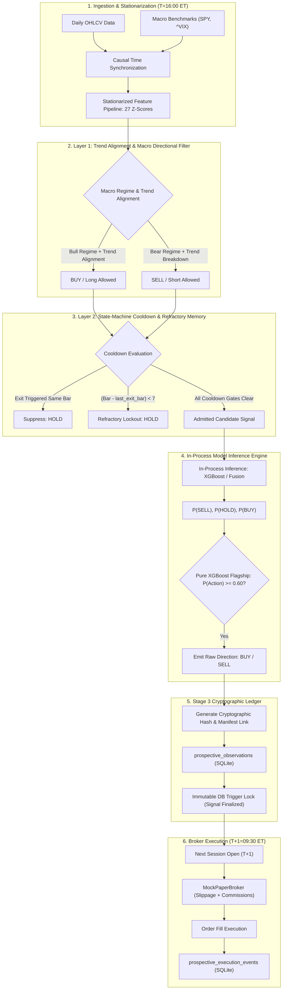

# Institutional Quantitative Trading Platform (HYDRA V2.3)

[](https://www.python.org/)
[](https://fastapi.tiangolo.com/)
[](https://nextjs.org/)
[](#)
[](https://github.com/astral-sh/ruff)

An institutional-grade systematic algorithmic trading, risk management, and quantitative execution platform designed for US equity markets. The system couples multi-modal market data ingestion, 27 stationarized feature pipelines, in-process machine learning signal generation, symmetric macro regime gating, dynamic asset expectancy filters, and Beta-calibrated trailing stop ratchets with a strictly manual on-demand end-of-day (EOD) execution engine.

Currently, the system is in **Stage 3 Prospective Validation (HYDRA V2.3)**, operating under an immutably frozen cryptographic manifest and a tamper-evident hash-chained prospective ledger.

---

## 1. Executive Summary & Production Philosophy

The platform operates under a foundational institutional mandate: **Alpha cannot exist without survival, and survival requires absolute empirical realism.**

Rather than deploying unconstrained deep neural networks or publishing unpenalized theoretical backtests, this platform enforces strict quantitative boundaries across all research and execution layers:

1. **Active Production Flagship Configuration**:
   $$\mathbf{Strategy} = \text{Pure XGBoost Alpha Driver} + \text{Symmetric Macro Gating} + \text{Dynamic Asset Expectancy Gate} + \text{Beta-Calibrated ATR Trailing Stops}$$
2. **Strict Causal Temporal Isolation (Stage 3 Protocol)**: All observations are logged strictly at $T$ (16:00 ET) using only information available at the close. The actual executable reference fill is logged at $T+1$ (09:30 ET). This strictly isolates signal generation from trade execution.
3. **Institutional Execution Friction**: All empirical metrics are reported **net of 12.0 basis points (bps) round-trip drag** (10.0 bps slippage + 2.0 bps exchange/clearing fees), accounting for realistic institutional order fill dynamics.
4. **Stage 3 Prospective Freeze**: The current candidate (HYDRA V2.3) is **immutably frozen**. No retraining, threshold modifications, or optimization loops are permitted based on interim performance. Alpha is determined solely via untouched prospective forward collection until $N \ge 50$ (Target $N=100$) independent trades are completed.
5. **Cryptographic Ledger Integrity**: All signals are appended to an immutable SQLite ledger with trigger-level enforcement and hash-chain linkage bridging the candidate manifest to every observation.

---

## 2. Institutional Command Center & Visual Telemetry

The platform features an institutional Next.js 16 command center (**HYDRA V2**) equipped with TradingView Lightweight Charts, real-time risk telemetry, multi-agent consensus transparency, and automated portfolio accounting.

**Features include:**
- Real-Time Consensus & Risk Analytics Panels
- Multi-Agent Model Consensus Matrices
- Institutional Risk Engine (Half-Kelly position sizing, VaR limits, macro regime status)
- Portfolio Management & Capital Allocation
- Technical Analytics & Regime Detection

---

## 3. End-to-End System Architecture

The following diagram maps the complete quantitative execution pipeline from market data ingestion through multi-layer filtering, in-process machine learning inference, capital allocation, and cryptographic SQLite state persistence:


```mermaid
flowchart TD
    subgraph Data_Layer ["1. Ingestion & Stationarization (T=16:00 ET)"]
        MD["Daily OHLCV Data"] --> Sync["Causal Time Synchronization"]
        BM["Macro Benchmarks (SPY, ^VIX)"] --> Sync
        Sync --> FE["Stationarized Feature Pipeline: 27 Z-Scores"]
    end

    subgraph Layer1 ["2. Layer 1: Trend Alignment & Macro Directional Filter"]
        FE --> MacroEval{"Macro Regime & Trend Alignment"}
        MacroEval -->|"Bull Regime + Trend Alignment"| LongPermitted["BUY / Long Allowed"]
        MacroEval -->|"Bear Regime + Trend Breakdown"| ShortPermitted["SELL / Short Allowed"]
    end

    subgraph Layer2 ["3. Layer 2: State-Machine Cooldown & Refractory Memory"]
        LongPermitted --> CooldownCheck{"Cooldown Evaluation"}
        ShortPermitted --> CooldownCheck
        CooldownCheck -->|"Exit Triggered Same Bar"| SuppressSameBar["Suppress: HOLD"]
        CooldownCheck -->|"(Bar - last_exit_bar) < 7"| PostStopCooldown["Refractory Lockout: HOLD"]
        CooldownCheck -->|"All Cooldown Gates Clear"| AdmittedSignal["Admitted Candidate Signal"]
    end

    subgraph Model_Layer ["4. In-Process Model Inference Engine"]
        AdmittedSignal --> Inf["In-Process Inference: XGBoost / Fusion"]
        Inf --> ProbDist["P(SELL), P(HOLD), P(BUY)"]
        ProbDist --> FlagshipGate{"Pure XGBoost Flagship: P(Action) >= 0.60?"}
        FlagshipGate -->|Yes| RawAction["Emit Raw Direction: BUY / SELL"]
    end

    subgraph Ledger_Layer ["5. Stage 3 Cryptographic Ledger"]
        RawAction --> HashGen["Generate Cryptographic Hash & Manifest Link"]
        HashGen --> InsertObs["prospective_observations (SQLite)"]
        InsertObs --> TriggerBlock["Immutable DB Trigger Lock (Signal Finalized)"]
    end

    subgraph Execution_Layer ["6. Broker Execution (T+1=09:30 ET)"]
        TriggerBlock --> TPlus1["Next Session Open (T+1)"]
        TPlus1 --> BrokerAdapter["MockPaperBroker (Slippage + Commissions)"]
        BrokerAdapter --> FillOrder["Order Fill Execution"]
        FillOrder --> SaveEvent["prospective_execution_events (SQLite)"]
    end
```

---

## 4. The 3-Layer Quantitative Architecture

The core trading and signal evaluation engine operates as a sequential three-layer state machine engineered to eradicate counter-trend whipsaws, duplicate signal clustering, and premature stop exits.

1. **LAYER 1: Trend Alignment & Macro Regime Filter**
   - Dual EMA Hierarchy (Fast 12 > Slow 24).
   - Multi-bar Momentum Slope Confirmation.
   - Macro Market Benchmark Gating (SPY vs SMA_50/SMA_200).
2. **LAYER 2: State-Machine Cooldown & Refractory Memory**
   - Isolation: Suppresses same-bar exit-and-reentry.
   - Post-Stop Refractory Cooldown: Lockout for 7 bars after stopout.
   - Intra-Direction Refractory Tracking: Prevents pyramiding within 7 bars.
3. **LAYER 3: Dynamic ATR-Ratcheting Trailing Stops (Bidirectional)**
   - Long Stops Ratchet Monotonically UP with new market highs.
   - Short Stops Ratchet Monotonically DOWN with new market lows.
   - Beta-Calibrated Distance: `ts_mult = clip(2.5 * max(1.0, beta_20d), 2.5, 4.0)`.

---

## 5. Beta-Calibrated Trailing Stops

Earlier trailing stop formulations scaled distance using an asset-to-index volatility standard deviation ratio. The platform resolves distortions by replacing raw standard deviation with the **rolling 20-day returns Beta against SPY**:

$$\text{ts\_mult} = \text{clip}\left(2.5 \times \max(1.0, \; \beta_{20\text{d}}), \; 2.5, \; 4.0\right)$$
$$\text{Stop Distance} = \text{ts\_mult} \times \text{ATR}_{14}$$

* **Low-Beta Defensive Drift ($\beta \le 1.00$)**: Clamped to $2.50\times$ ATR.
* **Median Tech Equities ($\beta \approx 1.20$)**: Scales dynamically to approximately $3.00\times$ ATR.
* **High-Beta Momentum ($\beta \ge 1.60$)**: Expands to the maximum ceiling of $4.00\times$ ATR.

---

## 6. Dynamic Asset Expectancy Filter (`AssetExpectancyFilter`)

The `AssetExpectancyFilter` enforces an automated performance circuit breaker by tracking the rolling 90-day realized out-of-sample Profit Factor (PF) per asset.

* **Suspension Trigger**: If an asset's trailing 90-day PF drops below **1.15**, new entry signals for that ticker are automatically suspended to `HOLD`.
* **Recovery Hysteresis**: A suspended asset must demonstrate a trailing PF of $\ge \mathbf{1.20}$ (or allow aged losses to roll out of the 90-day lookback) before new entries are cleared.

---

## 7. Model Fleet & Registry Hierarchy

All quantitative models are governed via an institutional role hierarchy.

| Model Identifier | Architecture | Assigned Role | Production Status | Threshold Mandate |
| :--- | :--- | :--- | :---: | :--- |
| **`XGB_AGENT`** | Gradient Boosted Decision Trees | `PRIMARY_ALPHA_DRIVER` | **ACTIVE** | $P(\text{BUY}) \ge 0.60$ triggers trade entry. |
| **`LGBM_AGENT`** | Leaf-Wise Regularized GBDT | `SECONDARY_VETO` | **ACTIVE** | Enabled via `--use-veto`. |
| **`DL_FUSION`** | 6-Branch Cross-Modal Attention Network | `QUARANTINED` | **QUARANTINED** | Capital destroyer historically. Bypassed. |
| **`DQN_AGENT`** | Dueling Double Deep Q-Network | `SECONDARY_VETO` | **RESEARCH ONLY** | Restricted to research due to MaxDD. |

---

## 8. HYDRA V2.3: Stage 3 Prospective Validation

HYDRA has formally entered **Stage 3 Prospective Validation**. The strategy logic, parameters, and models are cryptographically frozen. This phase is dedicated solely to undisturbed, forward out-of-sample data collection to prove statistical expectancy.

### Operational Mandates:
1. **Zero Strategy Mutation**: No retraining, optimization, or parameter changes are allowed.
2. **Cryptographic Manifest**: The strategy's exact configuration is bound by `artifacts/frozen_strategy_manifest_v2.3.json`, embedding the Git commit SHA, dataset SHA-256, and model/scaler fingerprints.
3. **Immutable Signal Ledger**:
   - Operations generate observations logged at $T$ (16:00 ET).
   - Each observation in `prospective_observations` includes a hash derived from the previous observation (Hash-chaining).
   - Database triggers natively reject any `UPDATE` or `DELETE` on finalized signal rows.
4. **Separation of Execution**: $T+1$ (09:30 ET) market open executions are stored separately in `prospective_execution_events`.
5. **The N=50 Gate**: No alpha evaluation or strategy assessment will occur until at least 50 (targeting 100) independent closed trades are collected. Once achieved, gates for Net P&L, Deflated Sharpe Ratio (DSR), Brier Score, ECE, and Regime Coverage will be assessed.
6. **Live Capital is PROHIBITED**: Real money deployment remains hard-blocked until Stage 3 is fully validated and engineering equivalents are met.

---

## 9. Manual On-Demand CLI & Operations Guide

The prospective execution engine is designed for **manual, on-demand CLI execution**. 

```bash
# Run the hardened Stage 3 prospective validation script
python scripts/ops/run_prospective_validation.py
```

*Note: For detailed telemetry or read-only portfolio checks, use the legacy `paper_runner.py` commands (`--status`, `--dry-run`), ensuring no database mutations bypass the cryptographic ledger.*

---

## 10. Repository Structure

```text
quantitative-trading-platform/
│
├── backend/
│   ├── api.py                          # FastAPI institutional backend service
│   ├── execution/                      # Legacy Execution & broker orchestration
│   ├── src/                            # Core application source
│   │   ├── execution/                  # Intelligence & logging modules
│   │   ├── models/                     # Architectures (XGB, LightGBM, DL, DQN)
│   │   ├── data_ingestion/             # Indicator pipelines
│   │   └── optimization/               # Objective functions & metrics
│   │
│   ├── configs/                        # System configuration files
│   │   └── kept_features.json          # Canonical 27 stationarized features
│   │
│   ├── artifacts/                      # Model weights, scalers, and manifests
│   │   ├── frozen_strategy_manifest_v2.3.json # Cryptographic Stage 3 manifest
│   │   ├── signal_ledger.db            # SQLite DB (Hash-chained prospective ledgers)
│   │   └── ...
│   │
│   ├── scripts/                        # Automation & operational scripts
│   │   ├── ops/                        
│   │   │   ├── run_prospective_validation.py # V2.3 Hardened Stage 3 Runner
│   │   │   ├── generate_manifest_v2_3.py     # Script to generate freeze manifest
│   │   │   └── ...
│   │   └── evaluation/                 # Institutional audit harnesses
│   │
│   └── tests/                          # Automated verification test suite
│
├── docs/                               # Documentation & Pine Script parity
└── frontend/                           # Institutional Next.js command center
```

---

## 11. Installation & Verification

### 11.1 Prerequisites
* **Python**: `3.11+`
* **Node.js**: `18.0+` (for optional Next.js command center)

### 11.2 Backend Setup
```bash
git clone https://github.com/dhruvin0041/quantitative-trading-platform.git
cd quantitative-trading-platform/backend
python -m venv venv
# Windows:
.\venv\Scripts\Activate.ps1
# Linux/macOS:
source venv/bin/activate
pip install -r requirements.txt
```

### 11.3 Automated Verification Suite
Ensure all institutional tests pass cleanly:
```bash
python -m unittest discover -s tests -p "test_*.py"
ruff check .
```

---

## 12. Legal & Operational Disclaimer

This platform is a quantitative software engineering and machine learning research project. All strategies, signals, mathematical formulas, and simulated paper execution records are intended solely for quantitative research, backtesting validation, and educational purposes. Nothing contained in this codebase constitutes financial, investment, legal, or tax advice. Past empirical performance does not guarantee future results.
