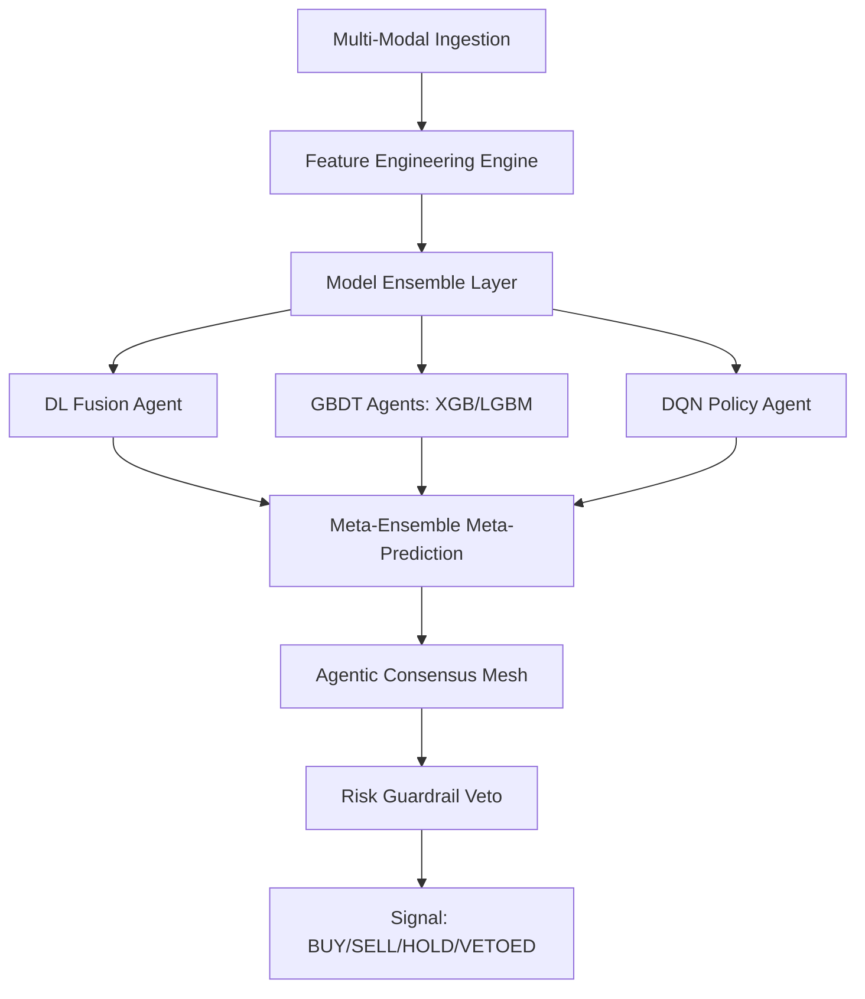

# SYSTEM ARCHITECTURE

## Overview
Hydra Terminal is a State-of-the-Art (SOTA) 2026 quantitative trading and market intelligence system. It utilizes a **Decentralized Multi-Agent Mesh** architecture to fuse multi-modal data into high-conviction institutional signals.

## 1. Modular Service Layer
The system is built on a strictly decoupled service architecture to ensure scalability and maintainability.

- **Inference Service (`inference_service.py`)**: Orchestrates the live prediction pipeline, coordinating between data ingestion, model management, and agentic consensus.
- **Model Manager (`model_loader.py`)**: Centralized registry for loading architectures, managing weights (DL, GBDT, RL), and tracking ensemble accuracies.
- **Backtest Service (`backtest_service.py`)**: Dedicated engine for historical performance retrieval and walk-forward summary generation.
- **FX Engine (`fx_engine.py`)**: Real-time currency normalization service providing live exchange rates for global portfolio accounting.

## 2. Multi-Modal Data Pipeline
Hydra integrates financial and physical intelligence layers:
1.  **Financial Layer**: Raw OHLCV data from Yahoo Finance and real-time SEC EDGAR filings (8-K/10-Q).
2.  **Physical Layer**: Geospatial intelligence via port-coordinate weather monitoring (Open-Meteo) and retail foot-traffic proxies (Google Trends simulation).
3.  **Qualitative Layer**: LLM-driven fundamental analysis using **Gemini 2.0 Flash** to detect "moving targets" and litigious risk.

## 3. The Agentic Mesh
The intelligence core consists of specialized agents that negotiate execution:
- **Alpha Agent**: Optimizes for expected return using a 4-branch fusion ensemble (LSTM, XGB, LGBM, DQN).
- **Risk Agent**: The "Final Arbiter" with absolute Veto power. Enforces Kelly sizing, Beta limits, and Crowd/Stampede risk checks.
- **Execution Agent**: Simulates institutional fills with 0.05% slippage and multi-currency accounting logic.

## 4. Signal Generation Flow

## 5. Deployment & Observability
- **Backend**: FastAPI (Async-first) with strict JSON structured logging.
- **Frontend**: Next.js 16.2 utilizing an intrinsic sizing model for institutional command center visuals.
- **Telemetry**: Integrated Prometheus metrics for latency and request tracking.
- **Storage**: JSON-based "Zero-State" persistence for paper trading and portfolio snapshots.
