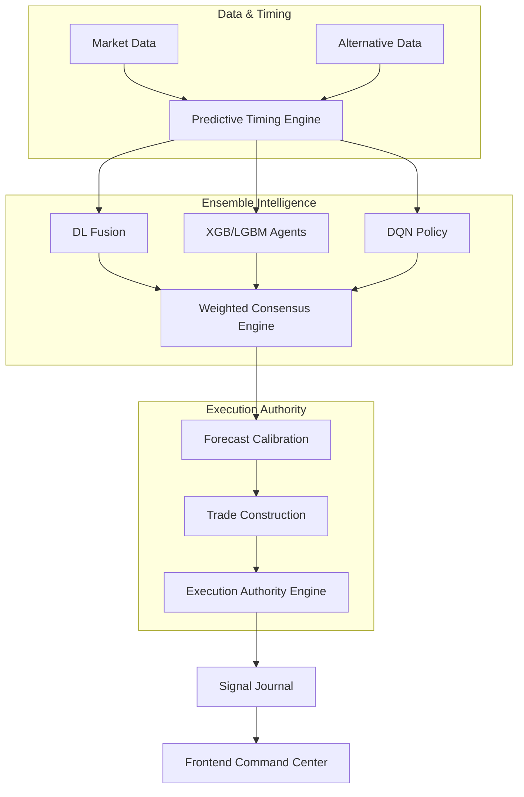

# SYSTEM ARCHITECTURE (V2.1.0 Institutional Upgrade)

## Overview
Hydra Terminal is a State-of-the-Art (SOTA) 2026 quantitative execution intelligence system. It utilizes a **Decentralized Multi-Agent Mesh** architecture to fuse multi-modal data into high-conviction, statistically validated institutional signals.

## 1. Modular Service Layer (Decision Mesh)
The system is built on a strictly decoupled service architecture, centered around the **Decision Mesh V2.1**.

- **Inference Service (`inference_service.py`)**: The primary orchestrator. Coordinates the flow from data ingestion through the predictive engines to the final Execution Authority.
- **Execution Authority Engine (`execution_authority.py`)**: The centralized decision layer. It converts lower-level signal telemetry into definitive institutional action states: `EXECUTE LONG`, `REDUCED SIZE`, `OBSERVE ONLY`, or `BLOCKED`.
- **Consensus Intelligence Engine (`consensus_engine.py`)**: Replaced unanimity logic with weighted directional pressure mapping and ensemble coherence analysis (Entropy/Fragmentation tracking).
- **Forecast Calibration Engine (`forecast_engine.py`)**: Institutional-grade projection engine that bounds forecasts using dynamic ATR-scaled volatility envelopes (P10/P50/P90).

## 2. Multi-Modal Data & Timing Pipeline
Hydra integrates financial, physical, and structural intelligence layers:
1.  **Financial Layer**: Raw OHLCV data from Yahoo Finance and real-time SEC EDGAR filings.
2.  **Predictive Timing Engine (`timing_engine.py`)**: A forward-looking structural engine that calculates momentum curvature (acceleration) and volatility expansion to detect transitions ahead of lagging indicators.
3.  **Qualitative Layer**: LLM-driven fundamental alpha extraction using **Gemini-2.0-Flash** to detect regime-breaking catalysts.

## 3. Institutional Governance Core
Specialized modules ensure mathematical integrity and prevent defensive paralysis:
- **Risk Metric Validator (`statistical_engine.py`)**: Enforces statistical significance via 90-day return gates and Wilson score intervals. Prevents "Impossible Metrics" (e.g., positive Sharpe with negative cumulative returns).
- **Signal Governance Analytics (`governance_engine.py`)**: Monitors the "Signal Starvation" threshold and Veto frequency to ensure the Risk Agent maintains healthy throughput.
- **Forensic Reset Engine (`forensic_reset.py`)**: Segments "Trusted Era" post-repair data from historical contaminated telemetry, ensuring institutional trust.

## 4. Signal Decision Lifecycle

## 5. Security & Persistence
- **Backend**: FastAPI (Async-first) with strict Pydantic schema enforcement.
- **Frontend**: Next.js 16.2 utilizing a Priority-Hierarchical UI model.
- **Governance**: SQLite-based `SignalJournal` for high-fidelity audit trails of every decision reasoning and execution state.
- **Statistical Eras**: Active tracking of the **Trusted Statistical Era (Start: 2026-05-27)** to isolate legacy calculation artifacts.
