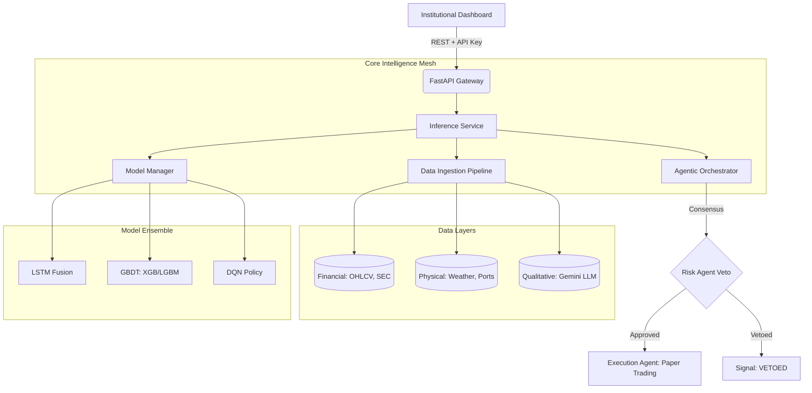

# 🐉 Hydra Terminal: System Overview & Onboarding Guide

Welcome to the Hydra Terminal team. This document serves as the definitive technical guide for understanding, operating, and contributing to the Hydra Terminal ecosystem. 

Hydra is not a simple "stock picker"—it is an institutional-grade **Multi-Agent Quantitative Intelligence Mesh** built for the 2026 market paradigm.

---

## 📖 1. The Hydra Philosophy

In modern systematic trading, the primary enemy is **Neural Pathway Contamination** and **Human Cognitive Bias**. Hydra solves this by:
1.  **Removing Emotion**: All signals are generated via mathematical consensus across an ensemble of competing agents (DL, GBDT, RL).
2.  **Zero-State Protocol**: Every research session begins with a systematic wipe of transient model weights to prevent cross-ticker data leakage.
3.  **Physical Grounding**: Traditional price-only models are "blind". Hydra integrates real-world physical proxies (Port disruptions, Weather, Search Interest) to ground its alpha in reality.

---

## 🏗️ 2. Architectural Blueprint

Hydra follows a strictly decoupled, service-oriented architecture.



### Key Service Components:

-   **FastAPI Gateway**: Handles authentication (X-API-Key), rate limiting, and request sanitization.
-   **Inference Service**: The brain of the system. It coordinates the lifecycle of a single prediction: from fetching port weather to triggering the DQN agent.
-   **Model Manager**: Loads and caches model weights. It handles the specific requirements of TensorFlow (Deep Learning) and PyTorch (Reinforcement Learning) simultaneously.
-   **FX Engine**: A critical service that provides real-time currency normalization for global universes (USD, INR, EUR, GBP).

---

## 🖥️ 3. Frontend: The Command Center

The frontend is a Next.js 16.2 application designed for high-density information display.

-   **Dashboard**: The primary monitoring hub. It uses an **Intrinsic Sizing Model** (dynamic layouts based on content importance rather than hardcoded pixels).
-   **Institutional Charts**: Powered by `lightweight-charts`, providing zero-latency technical visuals with integrated BUY/SELL markers.
-   **XAI Visualization**: Real-time SHAP bars that decompose the "Why" behind every model decision.
-   **Performance Console**: A dedicated view for portfolio attribution, drawdown analysis, and regime-based performance tracking.

---

## 🧠 4. Model Ensemble & Agentic Logic

Hydra utilizes four distinct branches of intelligence:

1.  **DL Fusion Agent**: A dual-branch LSTM that learns time-series momentum while simultaneously observing sector-peer correlations.
2.  **XGBoost/LightGBM Agents**: Specialized in high-dimensional tabular data. They excel at identifying non-linear threshold breaches in technical indicators.
3.  **DQN Policy Agent**: A Reinforcement Learning agent that optimizes the *timing* of execution. It learns to maximize reward (Profit - Risk) over sequential steps.
4.  **Risk Agent (The Arbiter)**: This agent has absolute Veto power. It checks every signal against VaR limits, Beta thresholds, and "Stampede Risk" (momentum crowding).

---

## 🛠️ 5. Developer Protocol

To maintain the system's SOTA standards, all contributors must follow the **Hydra Protocol**:

### The "Zero-State" Workflow
Before switching from research on Ticker A to Ticker B, you **must** run:
```bash
python scripts/ops/clean_artifacts.py
```
This ensures that model weights and scalers are re-initialized, preventing data leakage across different market contexts.

### Strict Verification
-   **Backend**: All code must pass `ruff check .`. No bare `except:` blocks allowed.
-   **Frontend**: 100% type coverage. No `any` types.
-   **Git**: Use Conventional Commits. No AI attribution in commit messages.

---

## 📈 6. Operational Modes

-   **Alpha Research Mode**: Used for feature discovery and backtesting (`scripts/research/`).
-   **Backtesting Mode**: Running Walk-Forward Optimization (WFO) to validate strategy robustness.
-   **Paper Trading Mode**: Live simulation of trades in a persistent JSON-based environment.

---

**Hydra Terminal** — built for precision, grounded in data, executed by agents.
