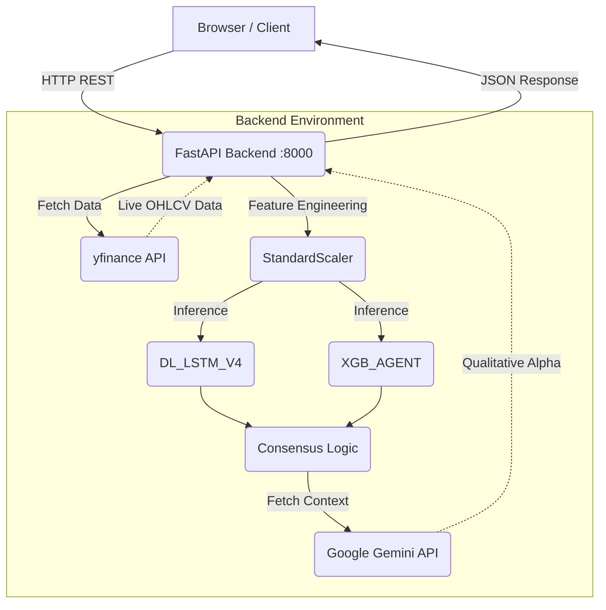

# 🐉 Hydra Terminal: System Overview & Onboarding Guide

Welcome to the Hydra Terminal team! This document is your complete guide to understanding, setting up, and contributing to the Hydra Terminal system. We assume you are a competent developer, but we don't assume you know anything about this specific codebase or the quantitative finance concepts it employs.

By the end of this document, you will understand exactly how every part of the system works, why it was built that way, and be ready to contribute on day one.

---

## 📖 1. What Is Hydra Terminal?

**Hydra Terminal** is an AI-powered stock signal system built specifically for institutional-style traders and quantitative analysts. 

At its core, Hydra Terminal solves a fundamental problem in trading: **removing human emotion from the decision-making process**. It achieves this by autonomously surfacing machine learning-driven **BUY** and **SELL** signals on S&P 500 stocks. 

Unlike a normal stock screener that simply filters stocks based on static, backward-looking metrics (e.g., "show me stocks with P/E < 15"), Hydra Terminal uses predictive models to forecast near-term price direction based on complex, non-linear patterns in historical data.

**The Core Value Proposition:**
Hydra Terminal replaces subjective chart reading with cold, hard machine learning consensus. By combining sequential pattern recognition (LSTM) with feature-based classification (XGBoost) and augmenting it with AI-driven qualitative context (Gemini), it provides traders with high-confidence, actionable signals backed by rigorous risk management metrics.

---

## 🏗️ 2. The Big Picture — How Everything Connects

Hydra Terminal follows a decoupled client-server architecture. The frontend is a Next.js React application that acts as the command center, while the backend is a FastAPI Python application that handles the heavy lifting of data retrieval, feature engineering, and model inference.



### The Connections Explained:

1. **Browser ↔ FastAPI Backend:** The Next.js frontend (running on port `3000`) communicates with the Python backend (running on port `8000`) via standard HTTP REST calls. The frontend is entirely stateless; it asks the backend for data and renders the response.
2. **FastAPI ↔ yfinance:** When the backend needs market data for a ticker, it calls the `yfinance` library. This fetches real-time and historical Open, High, Low, Close, Volume (OHLCV) data directly from Yahoo Finance.
3. **FastAPI ↔ ML Models:** The backend loads pre-trained machine learning models (an LSTM network and an XGBoost model) along with a data scaler. The raw `yfinance` data is transformed and fed into these models to generate directional probabilities.
4. **FastAPI ↔ Google Gemini API:** After the quantitative models generate a signal, the backend constructs a prompt containing the ticker, the signal, and market context, sending it to the Google Gemini API. Gemini returns a human-readable "Qualitative Alpha" analysis to explain *why* the market might be moving that way.

---

## 🖥️ 3. Frontend Deep Dive

The frontend is designed to look and feel like an institutional trading terminal (think Bloomberg Terminal, but modernized). Here is a breakdown of every visible UI element.

### Navbar
The top navigation bar provides branding, search, and global controls.
- **Brand:** The HYDRA TERMINAL logo establishes the identity.
- **Search Bar:** Connects to the `/universe` backend endpoint. It filters the S&P 500 stocks in real-time as the user types. Clicking a result loads that specific stock's data into the main dashboard.
- **Terminal Command Button (⌘K):** Opens a command palette (a modal overlay) for system-wide operations like "Export Snapshot", "Sync Display", and theme switching.
- **SYSTEM ONLINE Badge:** A visual indicator of backend health. A green dot means the backend is reachable on port `8000`.
- **Theme Toggle Button:** Switches the UI between the default dark mode (near-black) and light mode (off-white/orange). The preference is persisted to the browser's `localStorage`.

### Ticker Bar
Located just below the Navbar, this is a scrolling horizontal marquee.
- Displays all S&P 500 tickers sequentially.
- Shows the format: `TICKER +/-X.XX%`. The percentage is green for positive daily movement and red for negative.
- Acts as a continuous, real-time market pulse, updating periodically via backend polling.

### Sidebar — Coverage Universe
The left vertical panel lists the available trading universe.
- Lists all S&P 500 stocks alphabetically (e.g., AAPL, ABT, MMM).
- Each entry displays the ticker symbol (in bold) and the full company name.
- **Action:** Clicking any stock triggers a new call to the `/predict` API endpoint, causing the entire dashboard to re-render with that stock's data.
- The currently active stock is highlighted visually (an orange pill in light mode, or a colored background in dark mode).

### Main Chart Panel
The centerpiece of the application, displaying price action.
- Powered by a TradingView widget (typically lightweight-charts).
- Displays candlestick charts showing Open, High, Low, and Close prices.
- Defaults to showing approximately 1 year of daily candles.
- **Overlays:**
  - **BUY/SELL Markers:** Visual indicators (green up arrows for BUY, red down arrows for SELL) plotted directly on the chart. These markers correspond to the signal history returned by the `/predict` endpoint.
  - **Moving Averages:** MA20 and MA50 lines rendered in distinct colors to show short and medium-term trends.
  - **Support/Resistance:** Dotted horizontal lines indicating key price levels.
  - **Price Labels:** Right-axis labels showing the current price, key levels, and an orange "support floor" label (e.g., `240.97`).
- The chart's background and grid colors adapt automatically when the global theme (dark/light) changes. A "TV" watermark is visible in the bottom-left corner.

### Stock Header
Located above the main chart or analysis panels, summarizing the current state.
- Format: `TICKER | SIGNAL BADGE | CONFIDENCE% CONF | $PRICE`
- **SIGNAL BADGE:** A prominent red (SELL) or green (BUY) pill indicating the *current, live* consensus signal.
- **Confidence %:** A value from 0-100% representing how strongly the two ML models agree on the signal direction.
- **Price:** The most recent closing price fetched from `yfinance`.

### Bottom Row — Three Analysis Panels
Below the chart, three panels provide deep insights into the prediction.

1. **Model Consensus Panel:**
   - Breaks down the individual signals from the ML models.
   - Shows `DL_LSTM_V4` signal (SELL/BUY/HOLD) and its specific confidence %.
   - Shows `XGB_AGENT` signal (SELL/BUY/HOLD) and its specific confidence %.
   - **VETO Logic:** If the models disagree (e.g., one says BUY, the other says SELL), the overall consensus signal becomes `HOLD/VETOED`. The confidence scores displayed here are derived directly from the models' softmax probability outputs.

2. **10-Day Projections Panel:**
   - **FLOOR:** The lowest expected price over the next 10 trading days.
   - **CEILING:** The highest expected price over the next 10 trading days.
   - *Why?* These are calculated by combining the model's directional bias with recent historical volatility estimates.
   - **XAI Block (Explainable AI):**
     - **STATUS:** Shows the current posture (`VETOED`, `BULLISH`, `BEARISH`, `NEUTRAL`).
     - **Physical Supply Risk %:** A simulated metric derived from options/volume data (or static proxy logic) indicating market stress.
     - **Qualitative Alpha:** The human-readable rationale generated by the Google Gemini API.
     - *Fallbacks:* If Gemini is unavailable, it displays "Qualitative analysis unavailable". If rate-limited (common on free tiers), it displays a retry message.

3. **NLP Analysis Panel:**
   - Designed to summarize recent news and SEC EDGAR filings.
   - Provides a plain English summary of market sentiment.
   - Includes a source tag, e.g., `SOURCE: SEC EDGAR / NEWS`.
   - *Example:* "Market continues to show trend momentum. SEC FILING ALERT: 8-K - Current report".

### Right Panel — Live Portfolio
Simulates a live trading account to provide context for risk metrics.
- **TOTAL EQUITY:** The starting paper trading balance (e.g., `$1,000,000`).
- **AVAILABLE CASH:** Capital not currently deployed in active positions.
- **NET RETURN:** The percentage gain/loss relative to starting equity (starts at `+0.00%`).
- **ACTIVE POSITIONS:** The number of currently open trades (starts at `0`).
- **SYNC_ACTIVE Badge:** A visual confirmation that the portfolio data is syncing in real-time with the backend.

### Right Panel — Risk Management
Critical metrics for institutional trading.
- **VAR (95%) [Value at Risk]:** The maximum expected loss over a specific timeframe with 95% confidence. E.g., `-$2,450` means 95% of the time, we won't lose more than $2,450.
- **CVaR [Conditional Value at Risk]:** Also known as Expected Shortfall. The average expected loss *if* the VAR threshold is breached (the worst 5% of scenarios). Always a larger loss than VAR. E.g., `-$3,100`.
- **BETA:** Measures volatility relative to the broader market (S&P 500). A Beta of `0.85` means the asset is historically 15% less volatile than the index.
- **KELLY FRAC [Kelly Criterion]:** A mathematical formula used to determine the optimal size of a series of bets to maximize long-term wealth growth. E.g., `24%` suggests deploying 24% of available capital into this trade.
- **MAX DRAWDOWN:** The largest historical peak-to-trough drop in value. E.g., `-12.4%` means the worst historical loss from a high point was 12.4%.
- **ARMED Badge:** Indicates that automated risk management rules (like stop-losses) are actively enforced.

### Right Panel — System Validation
Historical performance metrics for the trading system.
- **Sharpe Ratio:** Measures risk-adjusted return (Return per unit of total risk/volatility). A value above `2.0` is generally considered excellent.
- **Sortino Ratio:** Similar to Sharpe, but only penalizes *downside* volatility (ignoring upside jumps). Higher is better.
- **Calmar Ratio:** Annualized return divided by the Maximum Drawdown. A ratio above `1.0` is good, indicating returns outpace the worst historical loss.
- **Profit Factor:** Gross profit divided by gross loss. A factor above `1.5` is solid.
- **Win Rate:** The percentage of historical signals that resulted in a profitable trade. E.g., `64.2%`.

---

## ⚙️ 4. Backend Deep Dive

The backend is built with FastAPI, prioritizing speed, explicit typing, and asynchronous request handling. If you are reading `api.py` for the first time, here is your map.

### FastAPI Application (`api.py`)
- This is the entry point for the backend server.
- It runs on `uvicorn` listening on port `8000`.
- **CORS (Cross-Origin Resource Sharing):** Explicitly configured to allow requests from `http://localhost:3000` (the frontend) to prevent browser security blocks.
- **Key Endpoints:**
  - `GET /universe`: Returns the list of all S&P 500 tickers and their corresponding company names. Used by the frontend sidebar and search.
  - `GET /predict?ticker=AAPL`: The core workhorse. Triggers the full ML inference and analysis pipeline for the requested ticker.
  - `GET /health`: A simple endpoint to verify the backend is running (used by the frontend's "SYSTEM ONLINE" badge).

### Live Inference Pipeline (`live_inference.py`)
This file orchestrates the transition from raw data to a final trading signal. Here is the exact step-by-step pipeline:

1. **Receive Request:** The function receives a ticker symbol (e.g., "AAPL") from the API layer.
2. **Fetch Data:** Uses `yfinance` to download approximately 2 years of daily OHLCV data.
3. **Engineer Features:** Calculates the specific technical indicators the models were trained on:
   - `Return`: Daily percentage change `(Close - Prev_Close) / Prev_Close`.
   - `Volume_Change`: Daily volume percentage change.
   - `High_Low`: Daily trading range `(High - Low)`.
   - `MA20`: 20-day Simple Moving Average.
   - `MA50`: 50-day Simple Moving Average.
4. **Apply Scaler:** Loads `latest_scaler.joblib`. This standardizes the engineered features (zero mean, unit variance) so they match the scale the models expect.
5. **LSTM Inference:** Passes the scaled features through the `DL_LSTM_V4` model to get a directional probability.
6. **XGBoost Inference:** Passes the scaled features through the `XGB_AGENT` model to get a second directional probability.
7. **Consensus Logic:** Combines the two probabilities to determine the final signal (BUY, SELL, or HOLD/VETOED) and calculates the overall confidence percentage.
8. **Calculate Projections:** Derives the 10-day floor and ceiling prices based on recent volatility and the signal direction.
9. **Gemini Analysis:** Calls the Google Gemini API, passing the ticker, recent price action, and the generated signal to get a human-readable qualitative analysis.
10. **Format Response:** Packages all data, signals, projections, and text into a JSON object and returns it to the API layer.

### The Scaler Artifact (`latest_scaler.joblib`)
> ⚠️ **CRITICAL COMPONENT**

This file contains a `scikit-learn` `StandardScaler` object that was saved (pickled) after being fitted on the historical training data.
- **Why it matters:** Neural networks and gradient boosting models require inputs to be on a similar scale. If you feed raw prices (e.g., $150) into a model expecting scaled values (e.g., between -2 and 2), the predictions will be garbage.
- **The Danger:** If this file is missing or deleted, the `/predict` endpoint will crash and return an HTTP 500 error.
- **The Fix:** It must be regenerated by running the dedicated script: `python regenerate_scaler.py`.
- **Rule:** Never run `clean_artifacts.py` in a production or live-testing environment, as it intentionally deletes this file to simulate a "zero-state".

### ML Models Explained
Hydra Terminal uses an ensemble approach to increase reliability.

1. **DL_LSTM_V4 (Deep Learning):**
   - Architecture: Long Short-Term Memory (LSTM) network.
   - Strength: LSTMs maintain an internal "state", making them excellent at identifying sequential and temporal patterns in time-series data (e.g., "how did price move over the last 10 days leading up to today?").
   - Output: A float between 0.0 and 1.0 (probability of upward movement).

2. **XGB_AGENT (Gradient Boosting):**
   - Architecture: XGBoost (Extreme Gradient Boosting) decision trees.
   - Strength: XGBoost is a feature-based classifier. It looks at the static snapshot of features on a given day to make a decision. It is fast and highly interpretable.
   - Output: A float between 0.0 and 1.0 (probability of upward movement).

3. **Consensus Logic (The Arbiter):**
   - We require *both* models to agree to trigger a trade.
   - **BUY:** Both model probabilities > 0.55.
   - **SELL:** Both model probabilities < 0.45.
   - **VETOED / HOLD:** Models disagree (e.g., one is >0.55, the other is <0.45), or predictions are in the "noisy" middle ground (0.45 - 0.55).
   - **Confidence Score:** Calculated as the average of the two probabilities, scaled to 100%.

### Gemini Integration
We use Large Language Models to provide "Qualitative Alpha"—human readable context for the quantitative signal.
- **Model:** `gemini-2.0-flash` (via Google AI Studio free tier).
- **Timing:** Called *after* the ML inference is complete. The generated ML signal is actually passed *into* the Gemini prompt (e.g., "The quantitative models just issued a SELL signal for AAPL. Given recent news and this price action, provide a brief analysis.").
- **Constraints:** The free tier is strictly rate-limited to **15 requests per minute**.
- **Resilience:** The backend wraps this call in a `try/catch` block. If the rate limit is hit, or the API fails, the backend gracefully catches the error and returns the string `"Qualitative analysis unavailable"`. It does *not* crash the `/predict` endpoint.
- **API Details:** 
  - Endpoint: `https://generativelanguage.googleapis.com/v1beta/models/gemini-2.0-flash:generateContent`
  - Authentication relies on the `x-goog-api-key` header (not standard Bearer token auth).

---

## 🔄 5. Data Flow — End to End

To solidify your understanding, here is the exact chronological sequence of events when a user selects a new stock.

1. **Action:** User clicks "AAPL" in the frontend sidebar.
2. **Request:** The Next.js frontend fires an HTTP GET request to `http://localhost:8000/predict?ticker=AAPL`.
3. **Routing:** The FastAPI backend receives the request in `api.py` and routes it to the `live_inference.py` pipeline.
4. **Data Acquisition:** `live_inference.py` connects to the `yfinance` API and downloads 2 years of daily AAPL data.
5. **Preprocessing:** The raw data is transformed into technical features (Returns, MAs, etc.), and `latest_scaler.joblib` is applied to normalize the values.
6. **Inference 1:** The scaled features are fed into the LSTM model. It outputs a probability, say `0.31` (bearish).
7. **Inference 2:** The scaled features are fed into the XGBoost model. It outputs a probability, say `0.28` (bearish).
8. **Consensus:** The logic evaluates the probabilities. Since both are `< 0.45`, the system generates a **SELL** signal with `~70%` confidence.
9. **Projection:** Floor and ceiling prices for the next 10 days are calculated based on AAPL's recent volatility.
10. **Context:** The system calls the Gemini API: *"AAPL has a SELL signal. Why?"*. Gemini returns a paragraph of qualitative analysis.
11. **Response:** The backend constructs a comprehensive JSON payload containing the signal, confidence, projections, Gemini text, and the raw chart data, sending it back to the frontend via HTTP 200.
12. **UI Update:** The frontend receives the JSON and updates state. The chart renders new candles and SELL arrows. The header badge turns red. The analysis panels populate with the new data and text.
13. **Risk Update:** The risk management panel (VAR, Kelly, etc.) recalculates its metrics based on adding a hypothetical AAPL short position to the portfolio.
14. **Completion:** The entire process completes and the UI re-renders, typically in under 2 seconds.

---

## 🎨 6. Theme System

Hydra Terminal employs a dual-theme architecture designed for zero-flicker loading.

- **Dark Mode (Default):** Near-black backgrounds, white text. Designed to reduce eye strain during long trading sessions.
- **Light Mode:** Off-white backgrounds (`#FDFAF5`) with distinctive orange accents (`#E8650A`).

### Implementation Details:
1. **The Toggle:** Controlled by a sun/moon icon in the top-right Navbar.
2. **DOM Manipulation:** Clicking the toggle adds or removes the `data-theme="light"` attribute on the root `<html>` element.
3. **CSS Scoping:** 
   - The dark mode CSS is the default base layer. It is never modified by JS.
   - All light-mode styles are strictly scoped under the `[data-theme="light"]` CSS selector. When the attribute is applied to the `<html>` tag, these styles override the base dark styles.
4. **Persistence:** The user's preference is saved to the browser's `localStorage` under the key `"theme"`.
5. **Zero-Flicker:** On initial page load, a tiny, render-blocking inline script runs in the `<head>`. It reads `localStorage` and applies the `data-theme` attribute *before* the browser paints the screen, preventing the dreaded "flash of wrong theme".
6. **TradingView Chart Integration:** The TradingView widget is drawn on a `<canvas>` element and doesn't inherit CSS directly. 
   - The React component listens for theme state changes.
   - Dark mode: Passes `theme: "dark"`, `backgroundColor: "rgba(15,15,15,1)"` to the widget config.
   - Light mode: Passes `theme: "light"`, `backgroundColor: "#FDFAF5"`.
   - The widget is dynamically re-initialized with the new config when the theme toggles.

---

## 🛠️ 7. Common Issues & Exact Fixes

Here are issues you will likely encounter, and exactly how to resolve them based on our development history.

**Issue 1: "Failed to connect to inference engine" error on frontend**
- **Cause:** The backend is either not running, or the `/predict` endpoint is crashing and returning a 500 error. Most commonly, this is because `latest_scaler.joblib` is missing.
- **Fix:** Ensure you are in the `backend` directory. Run `python regenerate_scaler.py`. Once complete, restart the backend server: `uvicorn api:app --reload`.

**Issue 2: "Qualitative analysis unavailable" appears in the XAI panel**
- **Cause 1:** You have hit the Gemini API free tier rate limit (15 requests per minute).
- **Cause 2:** The API call is configured with the wrong model string or endpoint.
- **Fix:** If it's a rate limit, simply wait 60 seconds. If it's persistent, verify your `live_inference.py` is targeting the `gemini-2.0-flash` model on the `v1beta` endpoint, and that authentication is passed via the `x-goog-api-key` header, *not* as a Bearer token.

**Issue 3: The TradingView chart shows a glaring white background when the rest of the app is in dark mode.**
- **Cause:** The widget component is not receiving or applying the dark theme configuration during initialization.
- **Fix:** Ensure the chart component passes `theme: "dark"` and `backgroundColor: "rgba(15,15,15,1)"` to the lightweight-charts configuration object. Ensure the widget is programmed to re-initialize when the React theme state changes.

**Issue 4: Typing in the search bar randomly opens the Command Palette.**
- **Cause:** A keyboard shortcut conflict. The search bar `onKeyDown` handler was mistakenly wired to the same `Ctrl+K` / `Cmd+K` listener used for the Command Palette.
- **Fix:** Disconnect the search input field from the command palette toggle logic. The search bar should only call the `/universe` endpoint and filter local results. Leave the Command Palette toggle exclusively bound to the `Cmd+K` global listener and the dedicated Navbar button.

**Issue 5: Light mode doesn't activate when clicking the toggle, even though the CSS exists.**
- **Cause:** The CSS requires the `data-theme` attribute to be present on the `<html>` tag, but the React component is only updating local React state, not the actual DOM element.
- **Fix:** Ensure the theme toggle function explicitly calls `document.documentElement.setAttribute('data-theme', 'light')` (or `removeAttribute` for dark mode) in addition to updating React state and `localStorage`.

**Issue 6: The Sidebar only shows 7 stocks instead of the full S&P 500.**
- **Cause:** During a previous refactor (often by an AI coding assistant), the dynamic call to the `/universe` endpoint was replaced with a hardcoded mock array to save time, and accidentally committed.
- **Fix:** Restore the `useEffect` hook in the sidebar component that fetches data from `http://localhost:8000/universe`. 
- > ⚠️ **Rule:** Never hardcode the stock list.

---

## 🚀 8. Environment Setup for New Developers

Follow these steps exactly to get your local environment running.

### Prerequisites:
- **Node.js:** v18 or higher (for the Next.js frontend).
- **Python:** v3.11 or higher (for the FastAPI backend).
- **Git:** For version control.
- **Google AI Studio Account:** You need a free API key for the Gemini integration. Get it here: [https://aistudio.google.com/apikey](https://aistudio.google.com/apikey).

### Step 1: Clone the Repository
```bash
git clone <repo-url>
cd hydra-terminal
```

### Step 2: Backend Setup
Open a terminal window and navigate to the backend directory:
```bash
cd backend
```

Install the required Python packages:
```bash
pip install fastapi uvicorn yfinance scikit-learn joblib xgboost tensorflow python-dotenv google-generativeai
```

Create your environment configuration file:
```bash
touch .env
```
Open the `.env` file and add the following, pasting in your real API key:
```env
GOOGLE_API_KEY=your_gemini_api_key_here
PORT=8000
ENVIRONMENT=development
```

Generate the critical ML scaling artifact:
```bash
python regenerate_scaler.py
```

Start the FastAPI development server:
```bash
uvicorn api:app --host 0.0.0.0 --port 8000 --reload
```
*Leave this terminal window running.*

### Step 3: Frontend Setup
Open a **new** terminal window and navigate to the frontend directory:
```bash
cd frontend
```

Install Node dependencies:
```bash
npm install
```

Start the Next.js development server:
```bash
npm run dev
```

### Step 4: Verification
Open your browser and navigate to `http://localhost:3000`. Verify the following:
1. The left sidebar is populated with 100+ stocks (not just a handful).
2. Clicking a stock symbol loads the chart successfully, displaying BUY/SELL arrows.
3. The "Model Consensus" panel shows specific confidence percentages.
4. You do not see a "Failed to connect to inference engine" error banner.
5. The theme toggle in the top right successfully switches between dark and light modes.
6. Typing in the search bar filters the stock list, and does *not* open the command palette.

---

## 📜 9. Codebase Rules & Conventions

To maintain system integrity, all developers must adhere to these rules:

> ⚠️ **CRITICAL RULES**
> - **NEVER run `clean_artifacts.py` in your active development or production environments.** It is a destructive script that deletes model artifacts and the `latest_scaler.joblib`, which will crash the API.
> - **NEVER hardcode the stock list in the frontend.** The universe changes; always fetch dynamically from the backend `/universe` endpoint.
> - **NEVER modify the core dark mode CSS.** Dark mode is the foundational style. Only add overrides within the `[data-theme="light"]` scope for the light theme.

**General Conventions:**
- **Graceful Degradation:** Always wrap external API calls (like Gemini) in `try/catch` blocks. Provide safe fallback strings (e.g., "Analysis unavailable") instead of letting the application crash.
- **Port Discipline:** The backend ALWAYS runs on port `8000`. The frontend ALWAYS runs on port `3000`. Do not change these defaults.
- **API Routing:** All frontend API calls must target `http://localhost:8000`.
- **State Management:** The UI theme state must be synced with the `localStorage` key exactly named `"theme"`.
- **Version Control:** We use Conventional Commits. Your commit messages must follow this format: `type(scope?): description`. 
  - Valid types: `feat`, `fix`, `docs`, `refactor`, `chore`.
  - Example: `fix(chart): resolve background color issue in dark mode`.

---

## 📚 10. Glossary of Terms

As a developer new to quantitative finance, you will encounter domain-specific terminology. Here is your cheat sheet:

- **OHLCV:** Open, High, Low, Close, Volume. The standard format for historical stock price data.
- **LSTM (Long Short-Term Memory):** A specific architecture of Recurrent Neural Network (RNN) designed to remember long-term dependencies. Excellent for time-series forecasting.
- **XGBoost (Extreme Gradient Boosting):** A highly efficient, ensemble machine learning algorithm based on decision trees. Often used for classification tasks.
- **StandardScaler:** A data preprocessing technique that normalizes data so it has a mean of 0 and a standard deviation of 1. ML models require scaled data to train and infer correctly.
- **Scaler Artifact:** The saved (`.joblib` format) state of the StandardScaler after it was fitted on training data. Essential for scaling live data identically during inference.
- **Inference:** The process of feeding new, live data into a pre-trained machine learning model to generate a prediction.
- **Coverage Universe:** The specific list of stock tickers that the Hydra Terminal system is configured to monitor and analyze (currently the S&P 500).
- **Signal Confidence:** A percentage metric representing how strongly the LSTM and XGBoost models agree on the predicted price direction.
- **VETOED:** The system state when the two ML models produce conflicting predictions (e.g., one predicts BUY, the other SELL). Results in a HOLD recommendation.
- **XAI (Explainable AI):** Techniques used to make the decisions of complex ML models understandable to human operators.
- **Qualitative Alpha:** The human-readable rationale (generated by Gemini) explaining the market context around a quantitative trade signal.
- **VAR (Value at Risk):** A statistical measure quantifying the maximum expected financial loss within a specific timeframe at a given confidence level (usually 95%).
- **CVaR (Conditional Value at Risk):** Also known as Expected Shortfall. It quantifies the expected average loss in the scenarios where the VAR threshold is breached (the worst 5% of cases).
- **Kelly Criterion:** A mathematical formula used by professional bettors and traders to determine the optimal percentage of capital to risk on a single trade to maximize long-term growth.
- **Beta:** A measure of a stock's volatility relative to the overall market. A Beta > 1 means it is more volatile than the market; Beta < 1 means it is less volatile.
- **Max Drawdown:** The largest historical drop in portfolio value from a peak to a subsequent trough. A key measure of historical risk.
- **Sharpe Ratio:** A metric measuring risk-adjusted return (average return earned in excess of the risk-free rate per unit of volatility).
- **Sortino Ratio:** Similar to the Sharpe ratio, but it differentiates harmful volatility from total overall volatility by using the asset's downside deviation.
- **Calmar Ratio:** A performance metric calculating the annualized return divided by the maximum drawdown over a specific period.